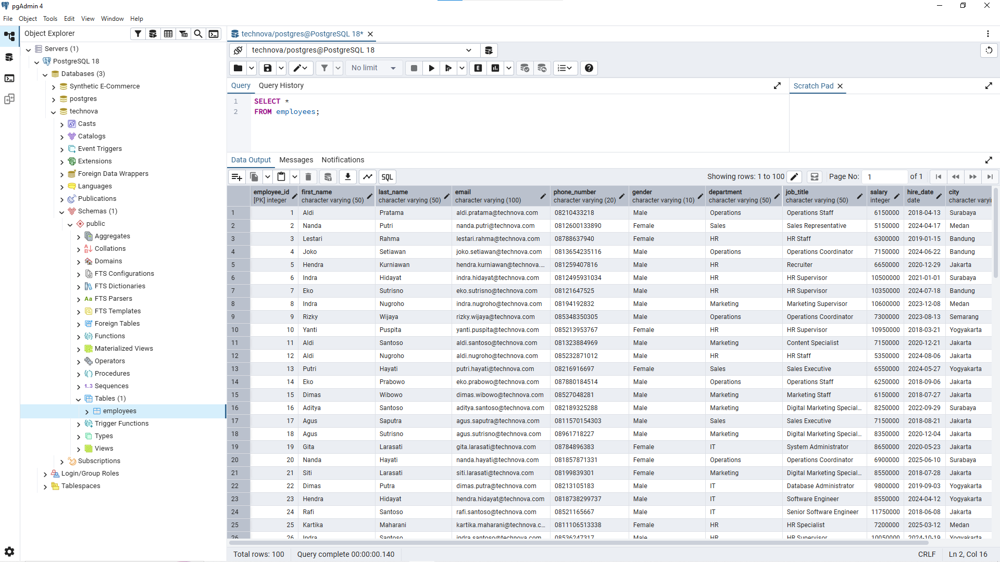
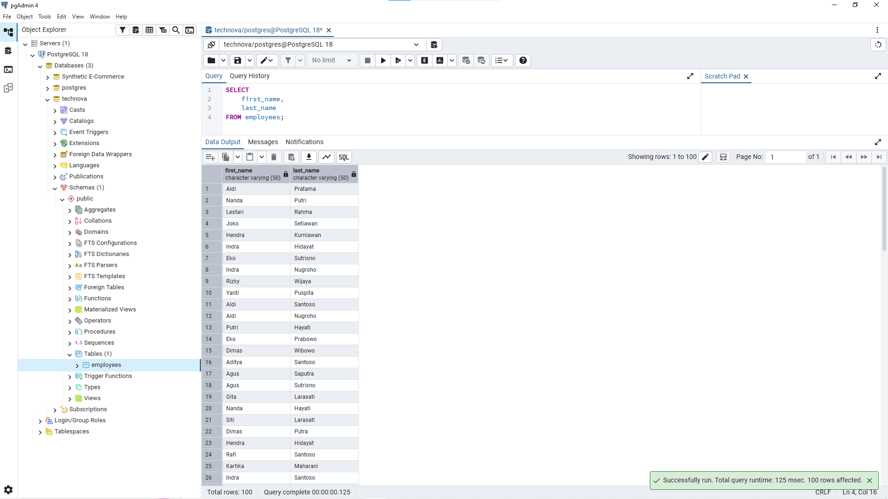
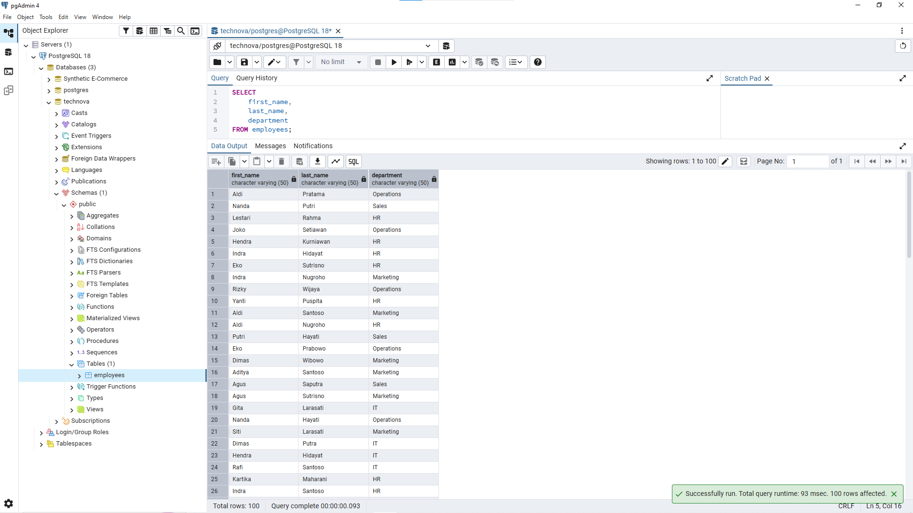
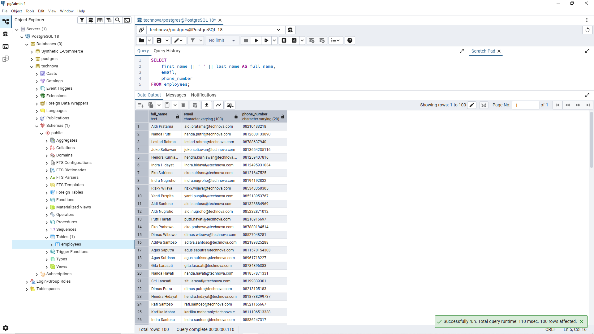

# Lesson 01 - SELECT

## Overview

This lesson focuses on retrieving data from the `employees` table using the `SELECT` statement.

The goal of this lesson is to understand how to retrieve relevant information from a database based on business requirements.

A Data Analyst needs to understand how to select the right data before performing further analysis.

---

## Business Scenario

Imagine you're a Junior Data Analyst at **TechNova Solutions**.

The HR team stores employee information in the company database. Different teams need different employee reports depending on their requirements.

Your task is to retrieve the required employee information using SQL `SELECT` statements.

---

## SELECT Statement

The `SELECT` statement is used to retrieve data from one or more columns in a database table.

In this project, data is retrieved from the `employees` table created in the previous lesson.

Example:

```sql
SELECT column_name
FROM employees;
```

The query above retrieves specific information from the employee database.

---

## Business Questions

### 1. Retrieve All Employee Data

**Business Question:**

"HR wants to view all available employee information from the database."


**Query:**

```sql
SELECT *
FROM employees;
```

**Result:**




**Purpose:**

This query is useful during initial data exploration to understand the available data and table structure.

Using `SELECT *` retrieves all columns from the table. It is useful for exploration, but in reporting situations, selecting only required columns is usually preferred.

---

### 2. Retrieve Employee Names

**Business Question:**

"HR wants to see a list of employee names."


**Query:**

```sql
SELECT
    first_name,
    last_name
FROM employees;
```

**Result:**




**Purpose:**

This query retrieves only employee names instead of displaying unnecessary information.

Selecting relevant columns helps make the output easier to understand.

---

### 3. Retrieve Employee Names and Departments

**Business Question:**

"The HR manager wants to understand which department each employee belongs to."


**Query:**

```sql
SELECT
    first_name,
    last_name,
    department
FROM employees;
```

**Result:**




**Purpose:**

This information can be used for organizational reporting and understanding employee distribution across departments.

The selected columns directly answer the business requirement without including unrelated employee information.

---

### 4. Create Employee Contact Directory

**Business Question:**

"HR wants to create an internal employee directory containing employee names, email addresses, and phone numbers."


**Query:**

```sql
SELECT
    first_name || ' ' || last_name AS full_name,
    email,
    phone_number
FROM employees;
```

**Result:**




**Purpose:**

This query combines first name and last name into a single column using an alias.

The output only contains information required for employee communication.

---

## Analyst Thinking

Before writing a query, a Data Analyst should consider:

- What business question needs to be answered?
- What information is required?
- Which columns are relevant?
- Should all columns be retrieved, or only specific columns?

The goal is not only to retrieve data, but to provide information that is useful for decision-making.

---

## Key Learning

In this lesson, I learned:

- How to retrieve data using the `SELECT` statement.
- How to select specific columns from a table.
- The difference between using `SELECT *` and selecting specific columns.
- How to choose relevant data based on business requirements.
- How to create a simple derived column using concatenation.

---

## Files

```
01_select/
│
├── README.md
├── queries.sql
└── images/
    ├── select_all_employee.png
    ├── select_employee_name.png
    ├── select_employee_department.png
    └── select_employee_contact.png
```
---

## Next Step

The next lesson will focus on filtering data from the `employees` table using the `WHERE` clause.
