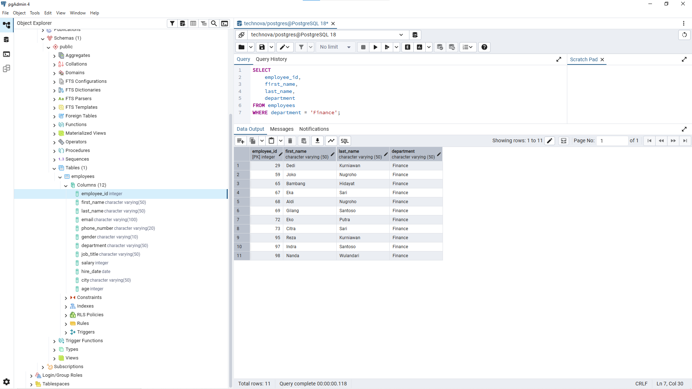
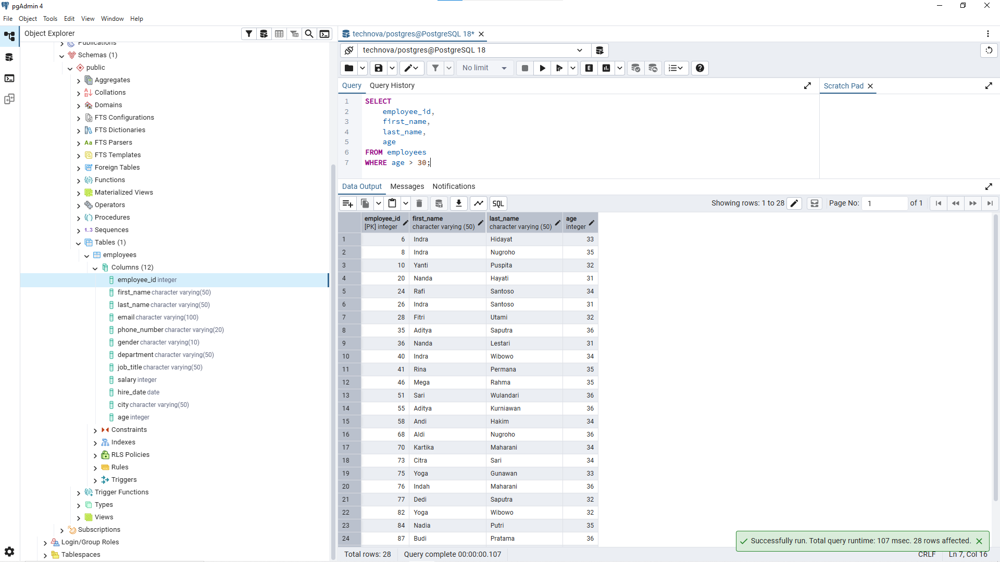
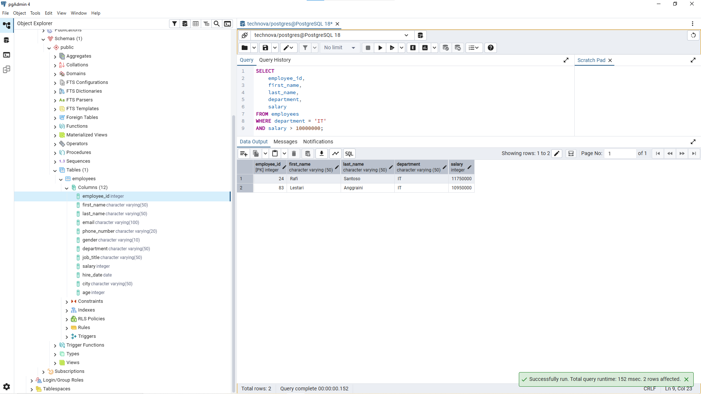
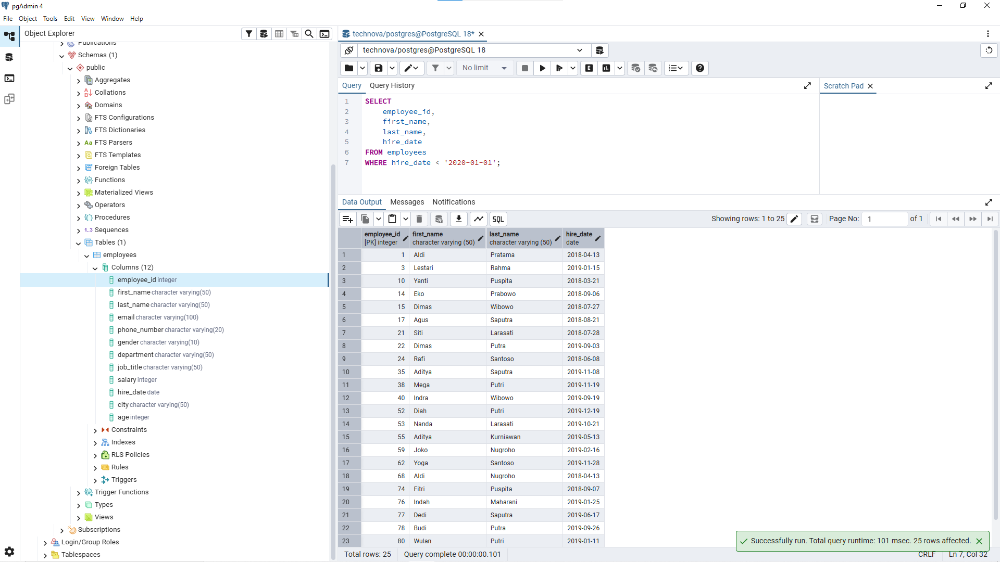

# Lesson 02 - WHERE

## Overview

This lesson focuses on filtering data from the `employees` table using the `WHERE` clause.

The goal of this lesson is to understand how to retrieve specific records from a database based on business requirements.

A Data Analyst needs to filter relevant data before performing analysis or creating reports.

---

## Business Scenario

Imagine you're a Junior Data Analyst at **TechNova Solutions**.

The HR team stores employee information in the company database. Different teams need specific employee reports based on certain conditions.

Your task is to filter employee data using SQL `WHERE` statements.

---

## WHERE Clause

The `WHERE` clause is used to filter rows based on specific conditions.

In this project, data is filtered from the `employees` table created in the previous lesson.

Example:

```sql
SELECT column_name
FROM employees
WHERE condition;
```

The query above retrieves only records that match the given condition.

---

## Business Questions

### 1. Find Employees from Finance Department

**Business Question:**

"HR wants to see all employees who work in the Finance department."


**Query:**

```sql
SELECT
    employee_id,
    first_name,
    last_name,
    department
FROM employees
WHERE department = 'Finance';
```


**Result:**




**Purpose:**

This query helps HR identify employees based on their department.

Filtering data by department allows users to focus only on relevant employee groups instead of viewing the entire employee table.

---

### 2. Find Employees Over 30 Years Old

**Business Question:**

"The manager wants to see employees who are over 30 years old."


**Query:**

```sql
SELECT
    employee_id,
    first_name,
    last_name,
    age
FROM employees
WHERE age > 30;
```


**Result:**




**Purpose:**

This query demonstrates filtering numerical data using comparison conditions.

The result can be used for employee analysis based on specific age criteria.

---

### 3. Find IT Employees with High Salary

**Business Question:**

"HR wants to identify IT employees who earn more than 10 million."


**Query:**

```sql
SELECT
    employee_id,
    first_name,
    last_name,
    department,
    salary
FROM employees
WHERE department = 'IT'
AND salary > 10000000;
```


**Result:**




**Purpose:**

This query applies multiple filtering conditions using the `AND` operator.

Only employees who meet both conditions will be included in the result.

This approach helps analysts answer more specific business questions.

---

### 4. Find Experienced Employees

**Business Question:**

"The CEO wants to identify employees who have worked at the company since before 2020."


**Query:**

```sql
SELECT
    employee_id,
    first_name,
    last_name,
    hire_date
FROM employees
WHERE hire_date < '2020-01-01';
```


**Result:**




**Purpose:**

This query filters employee records based on date values.

Employees hired before 2020 are considered employees with longer company tenure based on the business definition.

---

## Analyst Thinking

Before writing a query, a Data Analyst should consider:

- What business question needs to be answered?
- Which table contains the required information?
- Which columns should be used as filtering conditions?
- Are the filtering conditions based on clear business definitions?

The goal is not only to filter data, but to make sure the filtering logic matches the actual business requirement.

---

## Key Learning

In this lesson, I learned:

- How to filter data using the `WHERE` clause.
- How to filter text, numerical, and date values.
- How to apply multiple conditions using the `AND` operator.
- How to translate business requirements into SQL filtering logic.
- How filtering helps analysts retrieve relevant information from larger datasets.

---

## Files

```
02_where/
│
├── README.md
├── queries.sql
└── images/
    ├── where_finance_employee.png
    ├── where_age_over_30.png
    ├── where_it_high_salary.png
    └── where_experienced_employee.png
```

---

## Next Step

The next lesson will focus on sorting and organizing query results using the `ORDER BY` clause.
