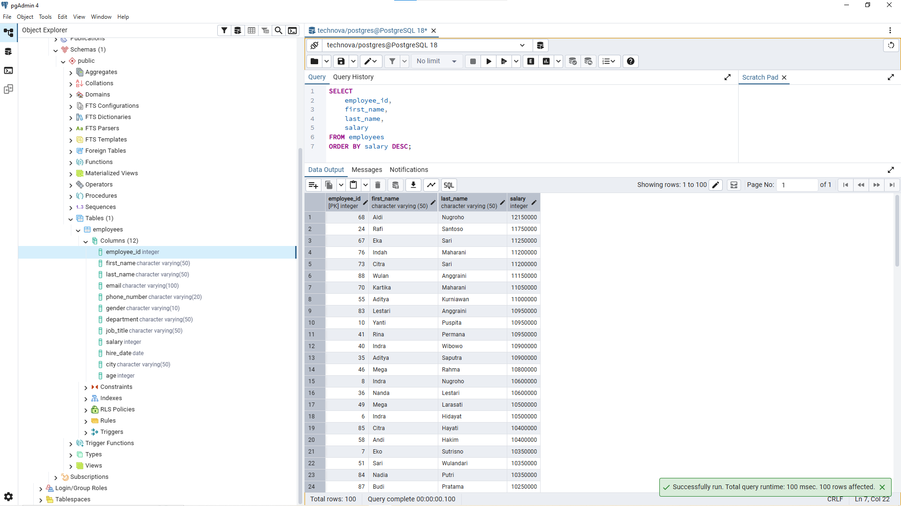
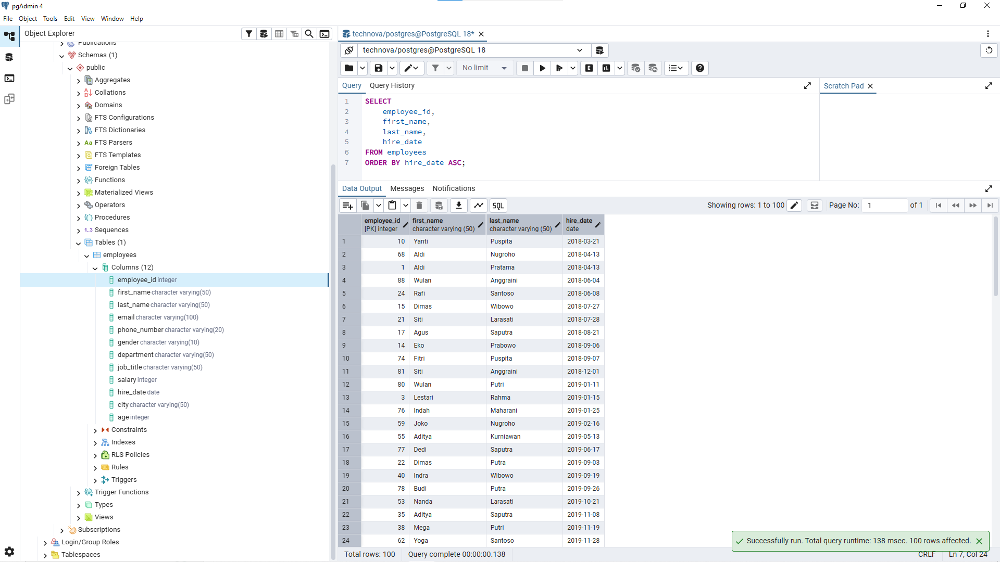
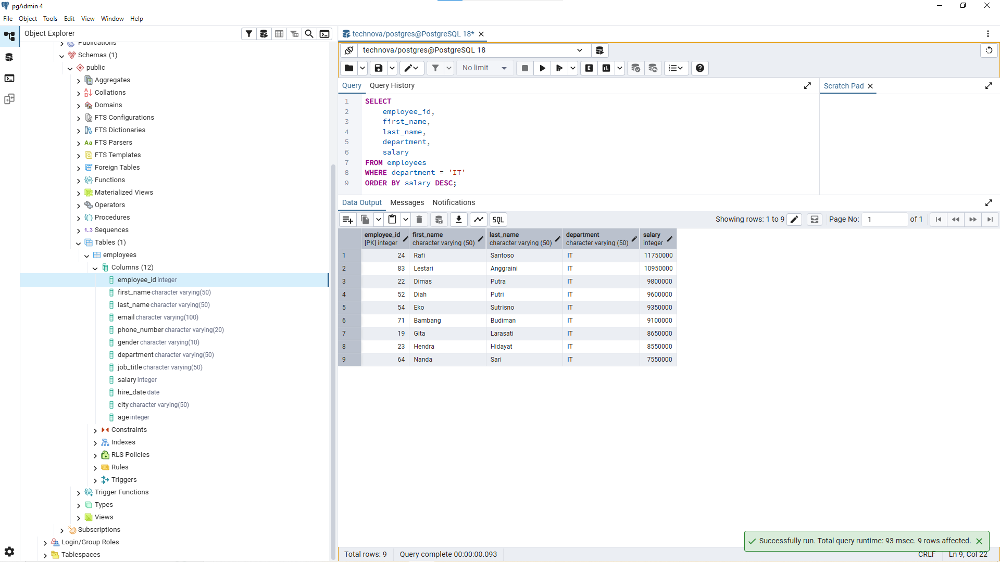
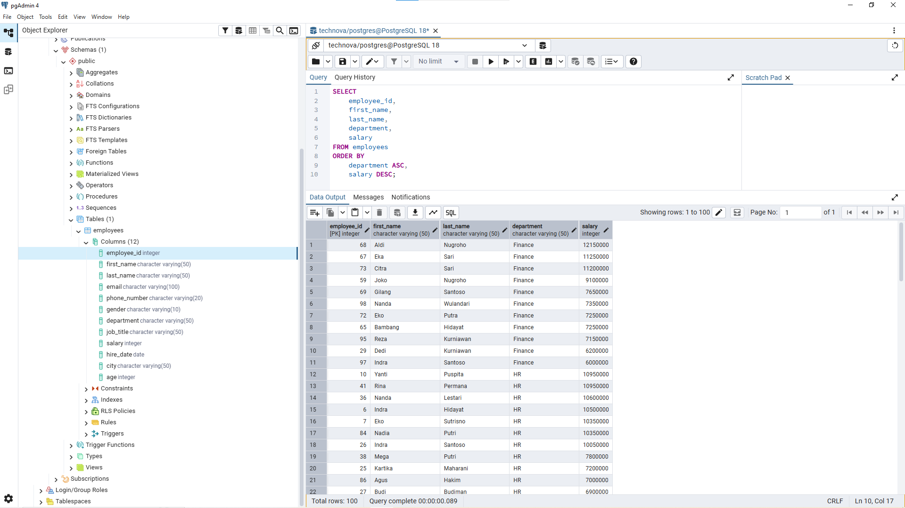

# Lesson 03 - ORDER BY

## Overview

This lesson focuses on sorting data from the `employees` table using the `ORDER BY` clause.

The goal of this lesson is to understand how to organize query results based on specific business requirements.

A Data Analyst needs properly sorted data to make reports easier to understand and identify important patterns.

---

## Business Scenario

Imagine you're a Junior Data Analyst at **TechNova Solutions**.

The HR team wants to analyze employee information based on different sorting requirements.

Your task is to organize employee data using SQL `ORDER BY` statements.

---

## ORDER BY Clause

The `ORDER BY` clause is used to sort query results based on one or more columns.

Sorting can be done in two ways:

- `ASC` (Ascending): smallest to largest, A-Z, oldest to newest.
- `DESC` (Descending): largest to smallest, Z-A, newest to oldest.

Example:

```sql
SELECT column_name
FROM employees
ORDER BY column_name ASC;
```

The query above sorts the result based on the selected column.

---

## Business Questions

### 1. Find Employees with Highest Salary

**Business Question:**

"HR wants to see employees with the highest salary."


**Query:**

```sql
SELECT
    employee_id,
    first_name,
    last_name,
    salary
FROM employees
ORDER BY salary DESC;
```


**Result:**




**Purpose:**

This query helps HR identify employees with the highest salary.

Sorting salary from highest to lowest makes it easier to analyze employee compensation.

---

### 2. Find Longest-Serving Employees

**Business Question:**

"HR wants to see employees from the longest-serving employees to the newest employees."


**Query:**

```sql
SELECT
    employee_id,
    first_name,
    last_name,
    hire_date
FROM employees
ORDER BY hire_date ASC;
```


**Result:**




**Purpose:**

This query sorts employees based on their joining date.

Employees with earlier hire dates appear first, helping HR analyze employee tenure.

---

### 3. Find Highest Paid IT Employees

**Business Question:**

"The manager wants to view IT employees sorted by salary from highest to lowest."


**Query:**

```sql
SELECT
    employee_id,
    first_name,
    last_name,
    department,
    salary
FROM employees
WHERE department = 'IT'
ORDER BY salary DESC;
```


**Result:**




**Purpose:**

This query combines filtering and sorting.

The result only shows IT employees and organizes them based on salary ranking.

---

### 4. Sort Employees by Department and Salary

**Business Question:**

"Finance wants to organize employees by department and compare salaries within each department."


**Query:**

```sql
SELECT
    employee_id,
    first_name,
    last_name,
    department,
    salary
FROM employees
ORDER BY
    department ASC,
    salary DESC;
```


**Result:**




**Purpose:**

This query demonstrates sorting using multiple columns.

Employees are grouped by department, then sorted by salary within each department.

---

## Analyst Thinking

Before writing a query, a Data Analyst should consider:

- What business question needs to be answered?
- Which column should determine the sorting order?
- Should the data be sorted ascending or descending?
- Does the sorting help users understand the information better?

The goal is not only to arrange data, but to create an output that supports business decisions.

---

## Key Learning

In this lesson, I learned:

- How to sort data using the `ORDER BY` clause.
- The difference between `ASC` and `DESC`.
- How to sort data using multiple columns.
- How sorting helps analysts organize information for reporting.
- How to translate business requirements into SQL sorting logic.

---

## Files

```
03_order_by/
│
├── README.md
├── queries.sql
└── images/
    ├── order_by_salary_desc.png
    ├── order_by_hire_date_asc.png
    ├── order_by_it_salary.png
    └── order_by_department_salary.png
```

---

## Next Step

The next lesson will focus on limiting query results using the `LIMIT` clause.
