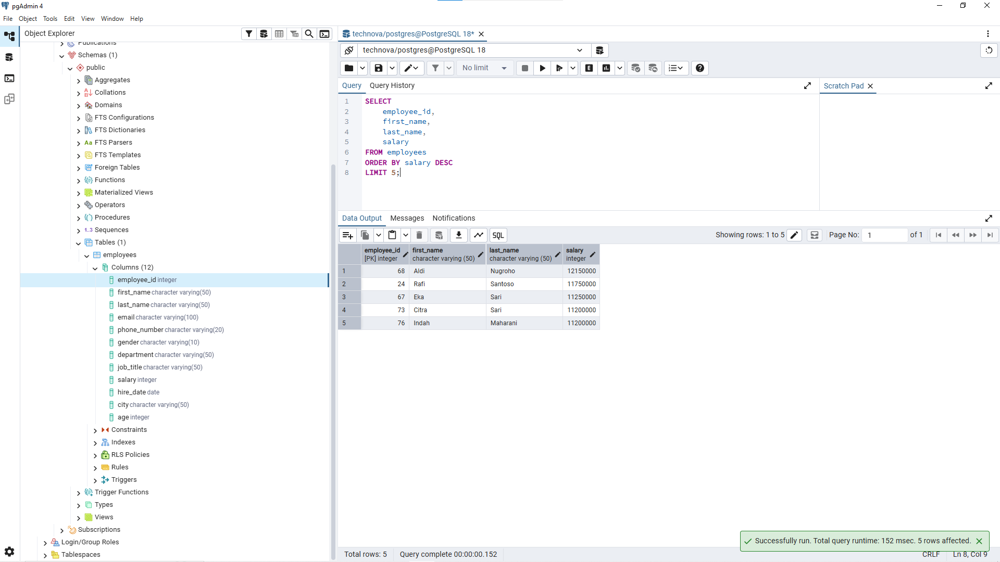
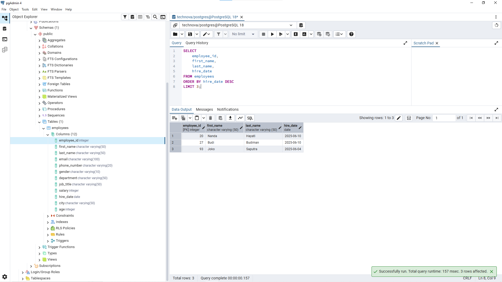
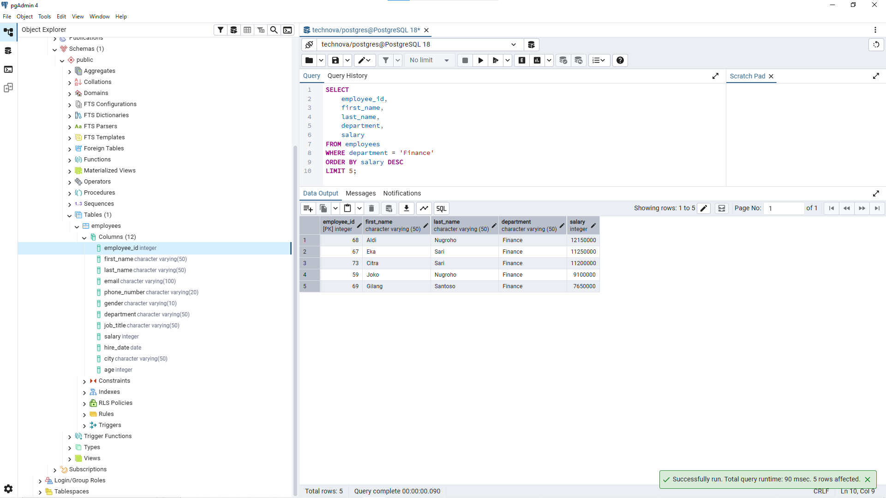
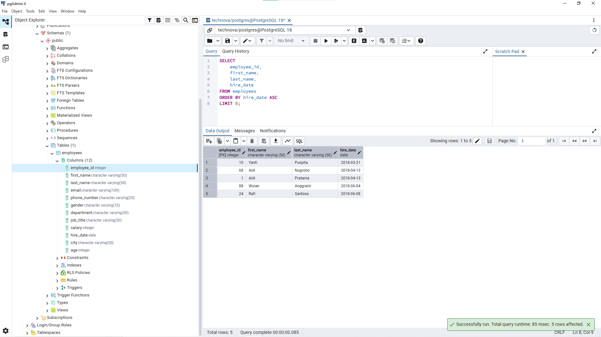

# Lesson 04 - LIMIT

## Overview

This lesson focuses on limiting query results from the `employees` table using the `LIMIT` clause.

The goal of this lesson is to understand how to retrieve a specific number of records based on business requirements.

A Data Analyst often works with large datasets and needs to focus on the most relevant records, such as top performers or recent employees.

---

## Business Scenario

Imagine you're a Junior Data Analyst at **TechNova Solutions**.

The company database contains employee information from different departments.

Management does not always need to see the entire dataset. They often need specific records such as employees with the highest salary or the newest employees.

Your task is to retrieve only the required number of records using SQL `LIMIT`.

---

## LIMIT Clause

The `LIMIT` clause is used to restrict the number of rows returned by a query.

Example:

```sql
SELECT column_name
FROM employees
LIMIT number;
```

The query above returns only the specified number of rows.

In real-world analysis, `LIMIT` is often combined with `ORDER BY` to create Top N analysis.

Example:

```sql
SELECT
    column_name
FROM employees
ORDER BY salary DESC
LIMIT 5;
```

The query above returns the 5 employees with the highest salary.

---

## Business Questions

### 1. Find Top 5 Highest Salary Employees

**Business Question:**

"HR wants to see the 5 employees with the highest salary."


**Query:**

```sql
SELECT
    employee_id,
    first_name,
    last_name,
    salary
FROM employees
ORDER BY salary DESC
LIMIT 5;
```


**Result:**




**Purpose:**

This query helps HR identify employees with the highest compensation.

Combining `ORDER BY` and `LIMIT` allows analysts to create Top N reports.

---

### 2. Find 3 Newest Employees

**Business Question:**

"The manager wants to see the 3 newest employees who joined the company."


**Query:**

```sql
SELECT
    employee_id,
    first_name,
    last_name,
    hire_date
FROM employees
ORDER BY hire_date DESC
LIMIT 3;
```


**Result:**




**Purpose:**

This query helps management identify recently joined employees for onboarding or workforce planning.

---

### 3. Find Top 5 Finance Employees by Salary

**Business Question:**

"Finance wants to see the 5 highest-paid employees from the Finance department."


**Query:**

```sql
SELECT
    employee_id,
    first_name,
    last_name,
    department,
    salary
FROM employees
WHERE department = 'Finance'
ORDER BY salary DESC
LIMIT 5;
```


**Result:**




**Purpose:**

This query demonstrates combining filtering, sorting, and limiting.

Analysts often use this approach to answer specific business questions.

---

### 4. Find Longest-Serving Employees

**Business Question:**

"HR wants to identify the 5 employees who have worked at the company the longest."


**Query:**

```sql
SELECT
    employee_id,
    first_name,
    last_name,
    hire_date
FROM employees
ORDER BY hire_date ASC
LIMIT 5;
```


**Result:**




**Purpose:**

This query retrieves employees with the earliest hire dates.

The result can support employee retention and workforce experience analysis.

---

## Analyst Thinking

Before using `LIMIT`, a Data Analyst should consider:

- Does the business need all records or only a specific number?
- What defines the ranking order?
- Should the data be sorted before limiting the result?
- Does "top" or "first" have a clear business definition?

A limited result is only meaningful when the sorting logic matches the business requirement.

---

## Key Learning

In this lesson, I learned:

- How to limit query results using the `LIMIT` clause.
- How `LIMIT` is used together with `ORDER BY`.
- How to create Top N analysis.
- Why sorting is important before limiting data.
- How to translate business requirements into SQL queries.

---

## Files

```
04_limit/
│
├── README.md
├── queries.sql
└── images/
    ├── limit_top_salary.png
    ├── limit_newest_employee.png
    ├── limit_finance_salary.png
    └── limit_longest_employee.png
```

---

## Next Step

The next lesson will focus on removing duplicate values using the `DISTINCT` clause.