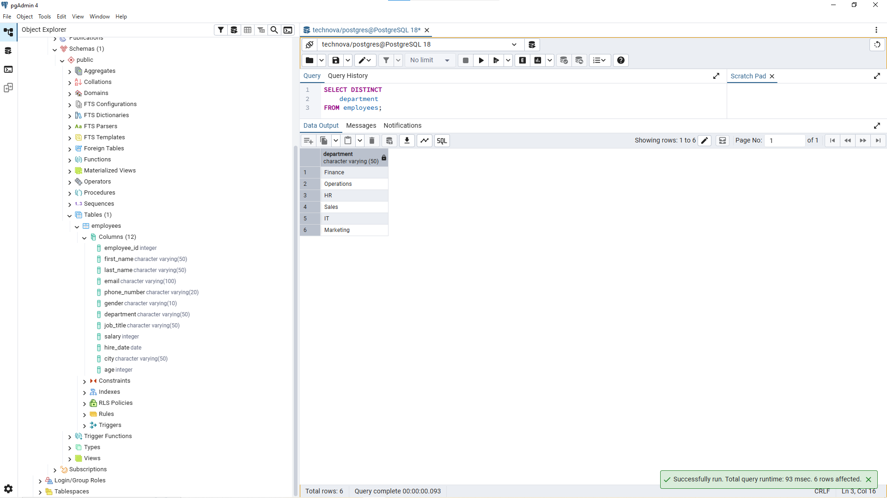
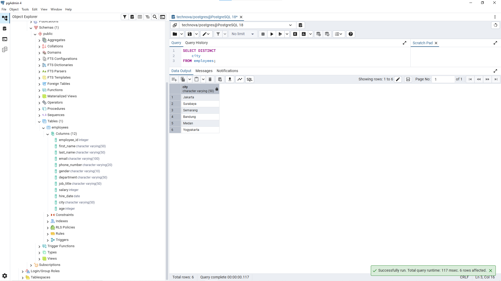
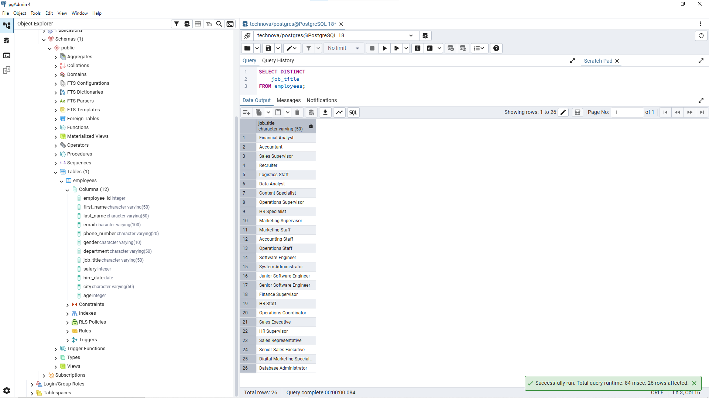
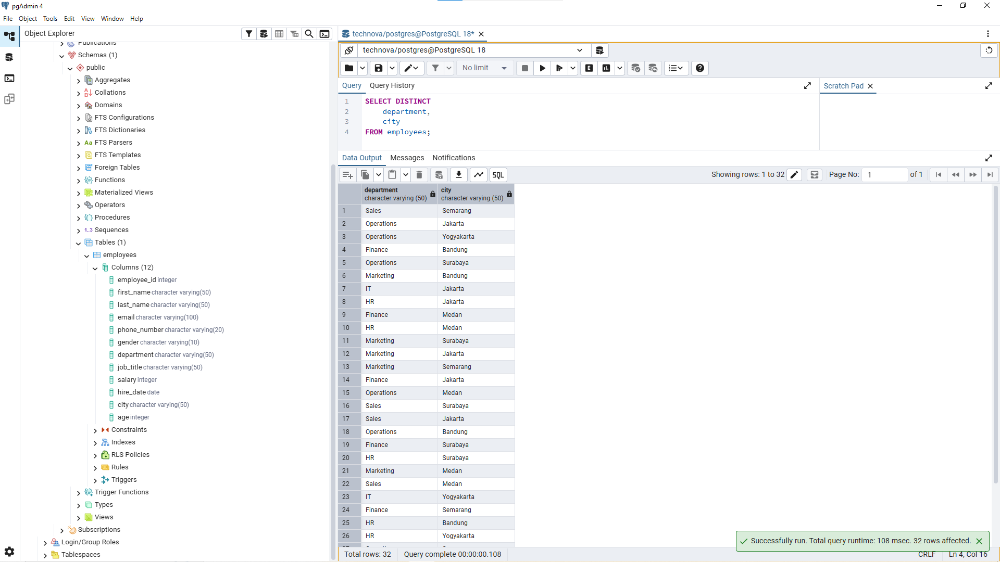
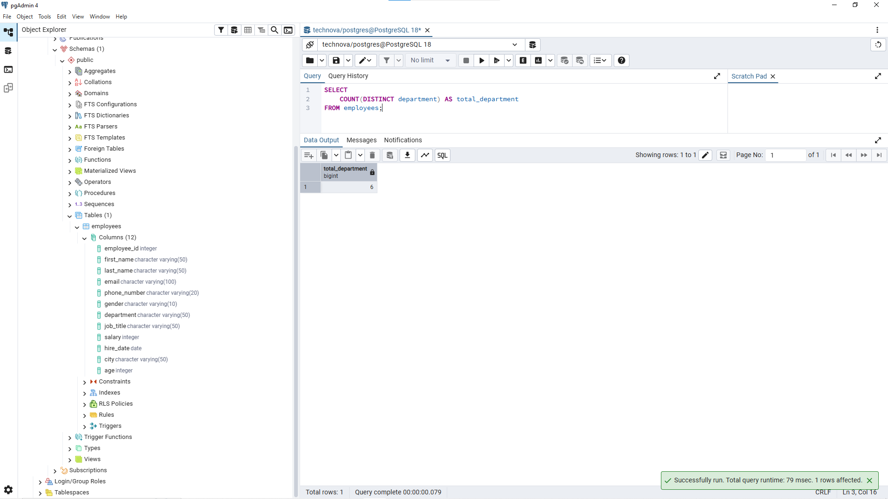

# Lesson 05 - DISTINCT

## Overview

This lesson focuses on retrieving unique values from the `employees` table using the `DISTINCT` clause.

The goal of this lesson is to understand how to explore categorical data and identify different values available in a dataset.

A Data Analyst often uses `DISTINCT` during data exploration to understand available categories before performing deeper analysis.

---

## Business Scenario

Imagine you're a Junior Data Analyst at **TechNova Solutions**.

The company database contains employee information from different departments, job positions, and locations.

Management wants to understand the different categories available in the employee database, such as departments, cities, and job titles.

Your task is to retrieve unique values using SQL `DISTINCT`.

---

## DISTINCT Clause

The `DISTINCT` clause is used to remove duplicate values from query results.

Example:

```sql
    SELECT DISTINCT column_name
    FROM employees;
```

The query above returns only unique values from the selected column.

`DISTINCT` is commonly used during data exploration to understand categories inside a dataset.

---

## Business Questions

### 1. Find Available Departments

**Business Question:**

"HR wants to know what departments exist in the company."

**Query:**

```sql
SELECT DISTINCT
    department
FROM employees;
```

**Result:**



**Purpose:**

This query helps identify the different departments available in the company.

Analysts often use this step before performing department-level analysis.

---

### 2. Find Employee Locations

**Business Question:**

"Management wants to know the cities where employees are located."

**Query:**

```sql
SELECT DISTINCT
    city
FROM employees;
```

**Result:**



**Purpose:**

This query helps understand employee distribution across different locations.

---

### 3. Find Available Job Positions

**Business Question:**

"HR wants to see all job positions available in the company."

**Query:**

```sql
SELECT DISTINCT
    job_title
FROM employees;
```

**Result:**



**Purpose:**

This query helps HR understand the different roles available inside the organization.

---

### 4. Find Unique Department and City Combinations

**Business Question:**

"Management wants to know the unique combinations of department and city."

**Query:**

```sql
SELECT DISTINCT
    department,
    city
FROM employees;
```

**Result:**



**Purpose:**

This query shows unique combinations between departments and locations.

This information can help analyze where different teams are distributed.

---

### 5. Count Unique Departments

**Business Question:**

"Management wants to know how many departments exist in the company."

**Query:**

```sql
SELECT 
    COUNT(DISTINCT department) AS total_department
FROM employees;
```

**Result:**



**Purpose:**

This query demonstrates the difference between retrieving unique values and counting unique values.

`DISTINCT` shows the list of categories, while `COUNT(DISTINCT)` returns the total number of unique categories.

---

## Analyst Thinking

Before using `DISTINCT`, a Data Analyst should consider:

- Am I looking for individual records or categories?
- Does the business need a list of unique values?
- Does the question ask "what are they?" or "how many are there?"
- Is duplicate data actually a problem?

`DISTINCT` is useful for exploring data categories, but it does not remove or modify the original data stored in the database.

---

## Key Learning

In this lesson, I learned:

- How to retrieve unique values using `DISTINCT`.
- How to explore categorical data.
- The difference between retrieving categories and counting categories.
- How `DISTINCT` can be combined with other SQL functions.
- How to translate business questions into SQL queries.

---

## Files

```
05_distinct/
├── README.md
├── queries.sql
└── images/
    ├── distinct_department.png
    ├── distinct_city.png
    ├── distinct_job_title.png
    ├── distinct_department_city.png
    └── distinct_total_department.png
```

---

## Next Step

The next lesson will focus on using operators in SQL to create more advanced filtering conditions.