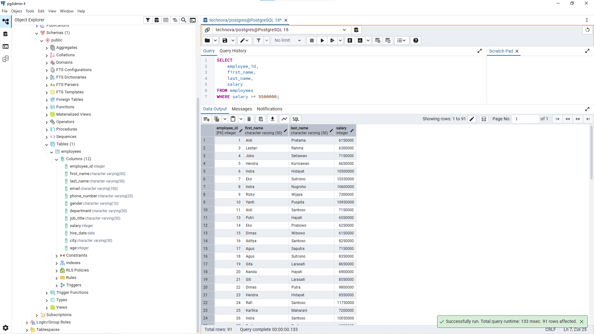
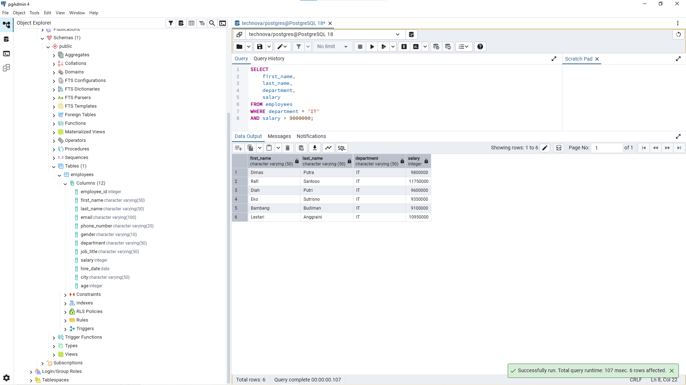
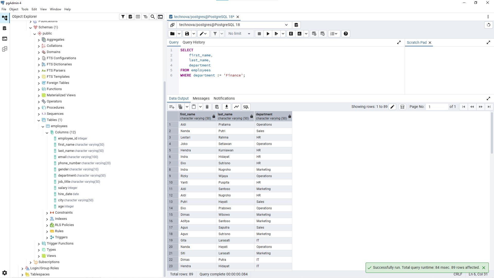
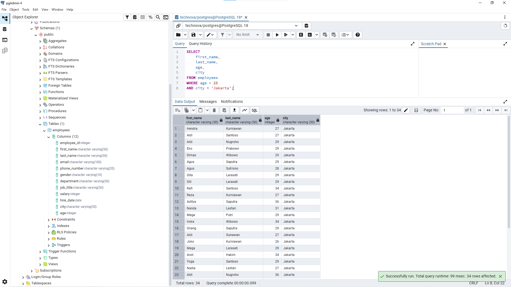
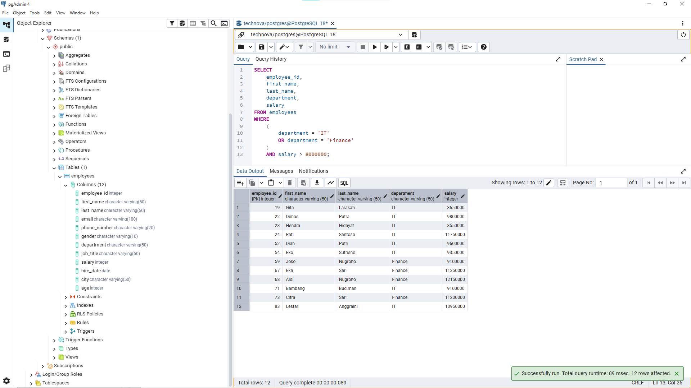

# Lesson 06 - Operators

## Overview

This lesson focuses on using SQL operators to create conditions when filtering data from the `employees` table.

The goal of this lesson is to understand how comparison and logical operators help analysts translate business requirements into SQL conditions.

A Data Analyst often uses operators when exploring data, filtering records, and answering specific business questions.

---

## Business Scenario

Imagine you're a Junior Data Analyst at **TechNova Solutions**.

The company wants to analyze employee data based on different criteria such as salary, age, department, and location.

Management needs specific information from the employee database to support decision-making.

Your task is to use SQL operators to filter employee records based on different business requirements.

---

## SQL Operators

SQL operators are symbols or keywords used to create conditions in a query.

Operators help SQL determine whether a record matches a specific requirement.

Example:

```sql
SELECT *
FROM employees
WHERE salary > 8000000;
```

The query above returns employees who have a salary greater than 8,000,000.

Common operators used in this lesson:

| Operator | Description |
|---|---|
| = | Equal to |
| != | Not equal to |
| <> | Not equal to |
| > | Greater than |
| < | Less than |
| >= | Greater than or equal to |
| <= | Less than or equal to |
| AND | Combine multiple conditions |
| OR | Match one of multiple conditions |
| NOT | Reverse a condition |

---

## Business Questions

### 1. Find Employees With Minimum Salary

**Business Question:**

"HR wants to see employees who have a minimum salary of Rp5,500,000."

**Query:**

```sql
SELECT
    employee_id,
    first_name,
    last_name,
    salary
FROM employees
WHERE salary >= 5500000;
```

**Result:**



**Purpose:**

This query helps HR identify employees who meet a minimum salary criteria.

The `>=` operator is used because employees with exactly Rp5,500,000 should also be included.

---

### 2. Find IT Employees With High Salary

**Business Question:**

"Manager wants to see IT employees with salary above Rp9,000,000."

**Query:**

```sql
SELECT
    first_name,
    last_name,
    department,
    salary
FROM employees
WHERE department = 'IT'
AND salary > 9000000;
```

**Result:**



**Purpose:**

This query demonstrates the use of `AND` operator.

Employees must satisfy both conditions:

- Department must be IT.
- Salary must be above Rp9,000,000.

---

### 3. Find Employees Outside Finance Department

**Business Question:**

"HR wants to see all employees except those who work in Finance department."

**Query1:**

```sql
SELECT
    first_name,
    last_name,
    department
FROM employees
WHERE department != 'Finance';
```

**Query2:**

```sql
SELECT
    first_name,
    last_name,
    department
FROM employees
WHERE department <> 'Finance';
```

**Result:**



**Purpose:**

This query uses the `!=` operator to exclude employees from a specific department.

This type of filtering is useful when analysts need to analyze groups outside a specific category.

---

### 4. Find Employees Based on Age and Location

**Business Question:**

"Management wants to find employees older than 25 years old who work in Jakarta."

**Query:**

```sql
SELECT
    first_name,
    last_name,
    age,
    city
FROM employees
WHERE age > 25
AND city = 'Jakarta';
```

**Result:**



**Purpose:**

This query combines multiple conditions using `AND`.

Only employees who meet both requirements will appear in the result.

---

### 5. Find Employees From IT or Finance With High Salary

**Business Question:**

"HR wants to find employees who work in IT or Finance, but their salary must be above Rp8,000,000."

**Query:**

```sql
SELECT
    employee_id,
    first_name,
    last_name,
    department,
    salary
FROM employees
WHERE
    (
        department = 'IT'
        OR department = 'Finance'
    )
    AND salary > 8000000;
```

**Result:**



**Purpose:**

This query demonstrates how multiple operators can be combined.

Parentheses are used to control the filtering logic:

- Employee must be from IT or Finance.
- Salary must be above Rp8,000,000.

---

## Analyst Thinking

Before using SQL operators, a Data Analyst should consider:

- What business requirement needs to be answered?
- Which conditions are required?
- Should all conditions be true, or only one?
- Does the filtering logic match the business question?
- Are parentheses needed to avoid incorrect results?

Operators are not only SQL syntax.

They represent business rules that are translated into database queries.

---

## Key Learning

In this lesson, I learned:

- How to use comparison operators in SQL.
- How to combine conditions using `AND` and `OR`.
- How to exclude data using `!=` or `<>`.
- How parentheses affect SQL logic.
- How to translate business requirements into filtering conditions.

---

## Files

```
06_operators/
├── README.md
├── queries.sql
└── images/
    ├── operators_salary.png
    ├── operators_it_salary.png
    ├── operators_not_finance.png
    ├── operators_age_location.png
    └── operators_multiple_condition.png
```

---

## Next Step

The next lesson will focus on using `LIKE` in SQL to search data based on specific patterns.