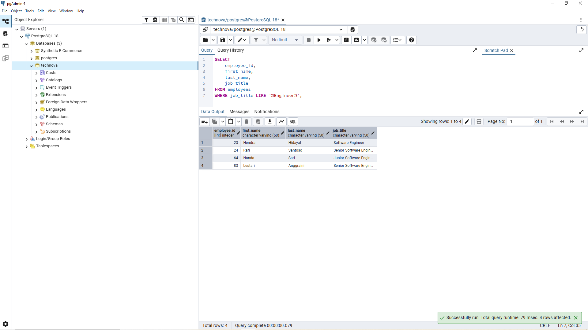
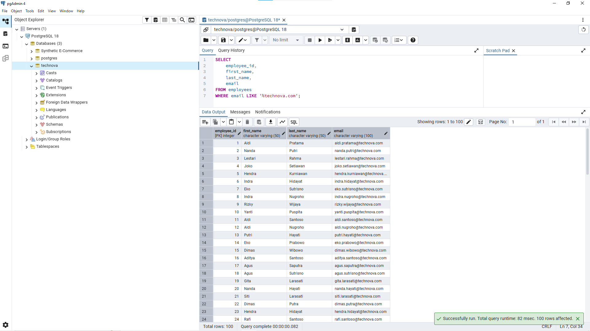
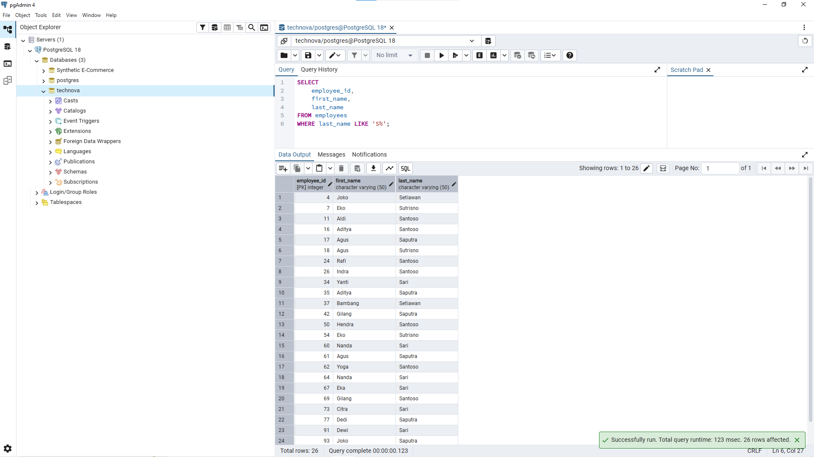
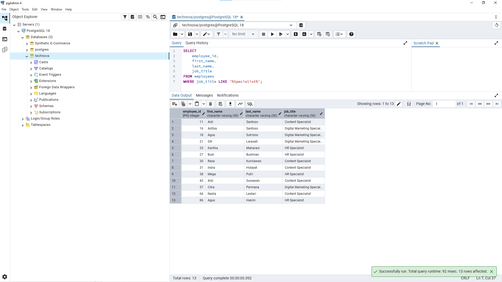
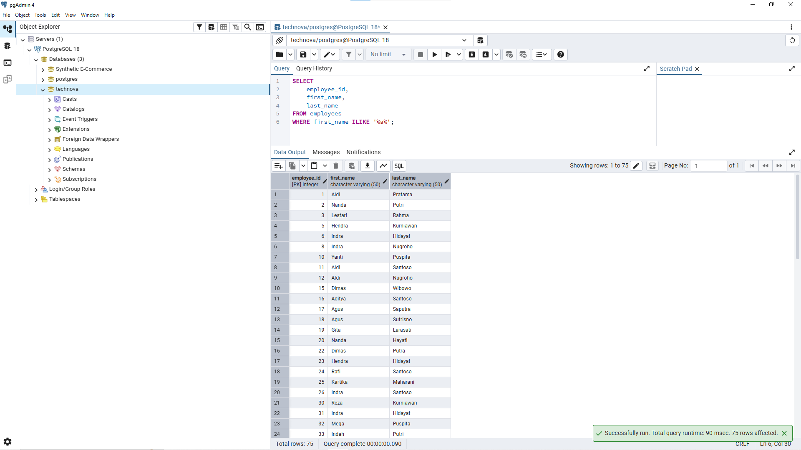
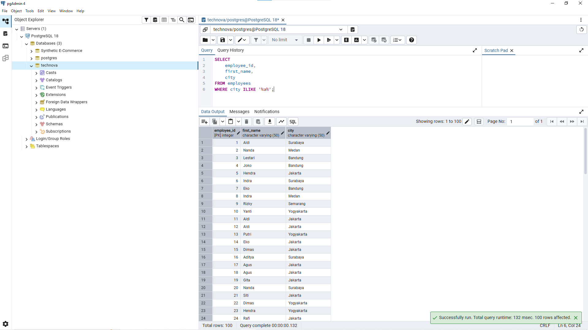

# Lesson 07 - LIKE

## Overview

This lesson focuses on using `LIKE` to search data based on specific text patterns.

The goal of this lesson is to understand how pattern matching helps analysts find data when the exact value is unknown or when a column contains different variations of text.

A Data Analyst often uses `LIKE` when searching employee names, job titles, email addresses, locations, and other text-based information.

---

## Business Scenario

Imagine you're a Junior Data Analyst at **TechNova Solutions**.

HR wants to analyze employee data using text-based criteria.

For example:

- Finding employees based on job title.
- Searching company email addresses.
- Finding names based on specific patterns.
- Filtering employees based on city names.

Your task is to use `LIKE` and `ILIKE` to answer these business questions.

---

## LIKE

`LIKE` is used to filter text data based on a specific pattern.

Unlike the `=` operator, `LIKE` does not require the entire value to match exactly.

Example:

```sql
SELECT *
FROM employees
WHERE job_title LIKE '%Engineer%';
```

The query above returns employees whose job title contains the word `Engineer`.

---

## Wildcards

`LIKE` uses wildcard characters to define patterns.

| Wildcard | Description |
|---|---|
| `%` | Matches zero or more characters |
| `_` | Matches exactly one character |

Example:

| Requirement | Pattern |
|---|---|
| Starts with A | `'A%'` |
| Contains A | `'%A%'` |
| Ends with son | `'%son'` |
| Exactly Manager | `'Manager'` |

The position of `%` depends on the business requirement.

---

## LIKE vs ILIKE

In PostgreSQL:

- `LIKE` is case-sensitive.
- `ILIKE` is case-insensitive.

Example:

```sql
WHERE first_name LIKE '%a%'
```

Only matches lowercase `a`.

Meanwhile:

```sql
WHERE first_name ILIKE '%a%'
```

Matches both:

```
a
A
```

`ILIKE` is useful when capitalization should not affect the search result.

---

# Business Questions


## 1. Find Employees With Engineer in Job Title

**Business Question:**

"HR wants to find employees whose job title contains the word `Engineer`."

**Query:**

```sql
SELECT
    employee_id,
    first_name,
    last_name,
    job_title
FROM employees
WHERE job_title LIKE '%Engineer%';
```

**Result:**



**Purpose:**

This query helps HR find different engineer positions.

The `%` wildcard is placed on both sides because the word `Engineer` can appear anywhere inside the job title.

Example:

- Software Engineer
- Junior Software Engineer
- Senior Software Engineer


---

## 2. Find Employees Using TechNova Email Domain

**Business Question:**

"HR wants to find employees whose email uses the `technova.com` domain."

**Query:**

```sql
SELECT
    employee_id,
    first_name,
    last_name,
    email
FROM employees
WHERE email LIKE '%technova.com';
```

**Result:**



**Purpose:**

This query finds employees using company email addresses.

`first_name` and `last_name` are included because they help identify the owner of each email address.


---

## 3. Find Employees With Last Name Starting With S

**Business Question:**

"HR wants to find employees whose last name starts with the letter `S`."

**Query:**

```sql
SELECT
    employee_id,
    first_name,
    last_name
FROM employees
WHERE last_name LIKE 'S%';
```

**Result:**



**Purpose:**

`S%` means the value must start with the letter `S`.

`employee_id` is included because employee names can have duplicates, and the ID helps identify the exact record.


---

## 4. Find Employees With Specialist in Job Title

**Business Question:**

"HR wants to find employees whose job title contains the word `Specialist`."

**Query:**

```sql
SELECT
    employee_id,
    first_name,
    last_name,
    job_title
FROM employees
WHERE job_title LIKE '%Specialist%';
```

**Result:**



**Purpose:**

This query helps HR find different specialist positions.

The `%` wildcard allows the word `Specialist` to appear anywhere in the job title.

Example:

- HR Specialist
- Content Specialist
- Marketing Specialist


---

## 5. Find Employees Whose First Name Contains A

**Business Question:**

"HR wants to find employees whose first name contains the letter `A` regardless of capitalization."

**Query:**

```sql
SELECT
    employee_id,
    first_name,
    last_name
FROM employees
WHERE first_name ILIKE '%a%';
```

**Result:**



**Purpose:**

`ILIKE` is used because the search should not be affected by uppercase or lowercase letters.

The `%` wildcard allows the letter to appear anywhere in the first name.


---

## 6. Find Employees Whose City Contains A

**Business Question:**

"Management wants to find employees whose city contains the letter `A` regardless of capitalization."

**Query:**

```sql
SELECT
    employee_id,
    first_name,
    city
FROM employees
WHERE city ILIKE '%a%';
```

**Result:**



**Purpose:**

This query searches employee locations based on text patterns.

It demonstrates how analysts can search data when the exact value is not provided.


---

# Analyst Thinking

Before using `LIKE`, a Data Analyst should consider:

- Is the requirement looking for an exact value or a pattern?
- Should the search happen at the beginning, middle, or end of the text?
- Should uppercase and lowercase letters be considered different?
- Is `LIKE` or `ILIKE` more appropriate?
- Are the selected output columns enough to identify the records?

The wildcard position should follow the business requirement.

Example:

Starts with:

```sql
'A%'
```

Contains:

```sql
'%A%'
```

Ends with:

```sql
'%son'
```

---

# Key Learning

In this lesson, I learned:

- How to use `LIKE` for pattern matching.
- How `%` and `_` wildcards work.
- How wildcard position changes the search result.
- The difference between `LIKE` and `ILIKE`.
- How to translate business requirements into text filtering logic.
- How to choose useful columns for query output.

---

# Files

```
07_like/
├── README.md
├── queries.sql
└── images/
    ├── like_engineer.png
    ├── like_email_domain.png
    ├── like_lastname_s.png
    ├── like_specialist.png
    ├── like_firstname_a.png
    └── like_city_a.png
```

---

# Next Step

The next lesson will focus on using `IN` and `BETWEEN` to filter data based on multiple values and ranges.