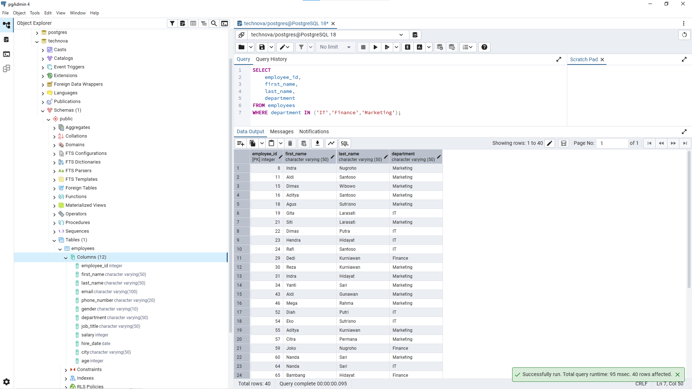
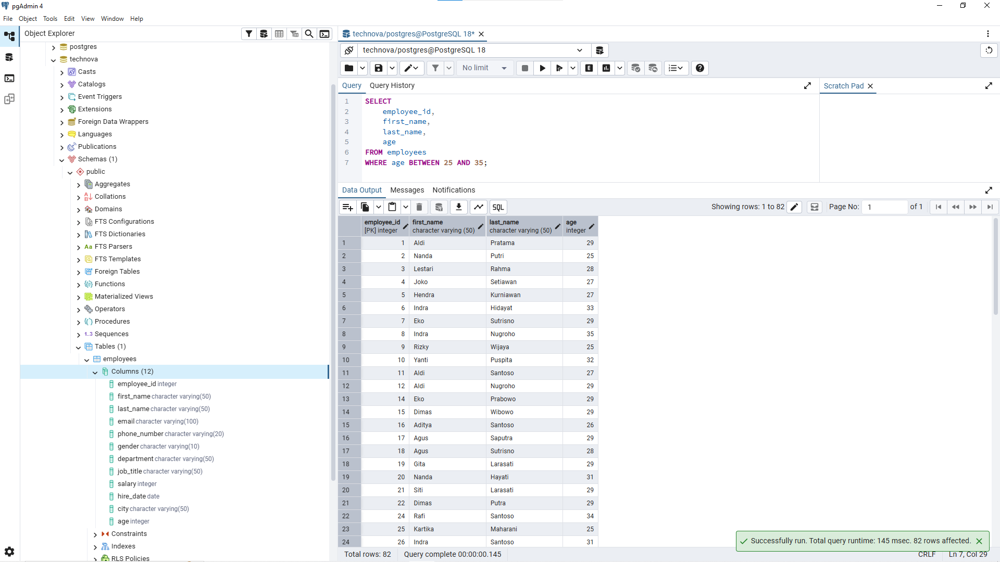
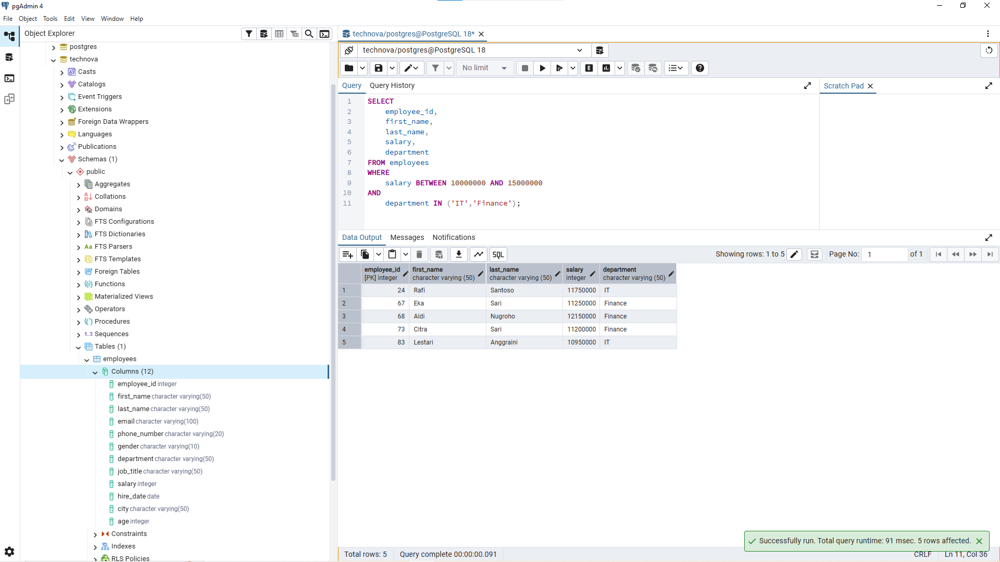
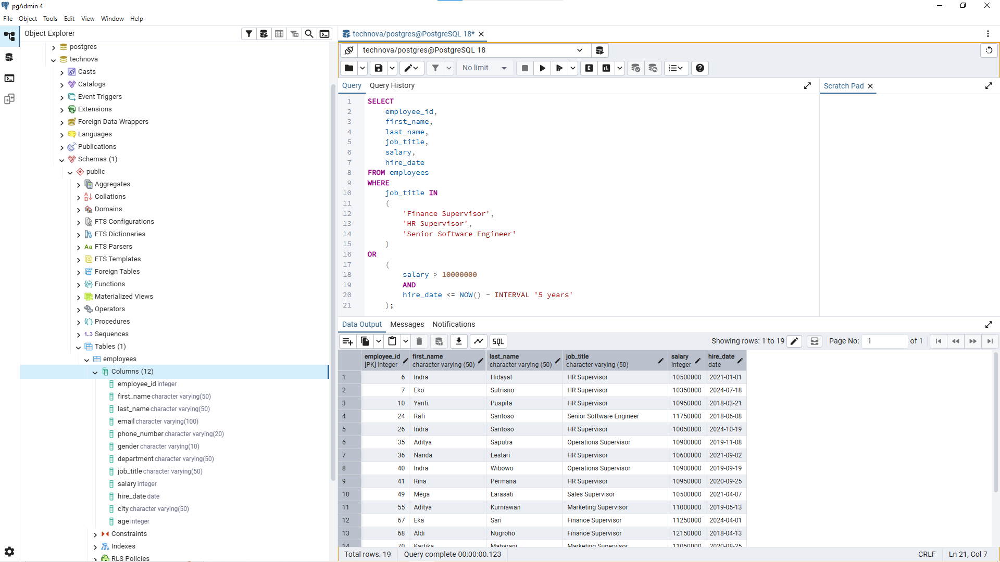

# Lesson 08 - IN & BETWEEN

## Overview

This lesson focuses on using `IN` and `BETWEEN` to filter data based on multiple values and specific ranges.

The goal of this lesson is to understand how analysts simplify filtering conditions when working with several categories or numerical ranges.

A Data Analyst often uses `IN` and `BETWEEN` when filtering departments, locations, salary ranges, dates, and other business-related data.


---

## Business Scenario

Imagine you're a Junior Data Analyst at **TechNova Solutions**.

HR and management want to analyze employee data using more specific filtering criteria.

For example:

- Finding employees from several departments.
- Filtering employees based on age range.
- Finding employees within a salary range.
- Identifying senior employees based on business rules.

Your task is to use `IN` and `BETWEEN` to answer these business questions.


---

# IN

`IN` is used to filter data when a column needs to match one of several possible values.

Example:

```sql
SELECT *
FROM employees
WHERE department IN ('IT','Finance','HR');
```

The query above returns employees from:

- IT
- Finance
- HR

Instead of writing multiple `OR` conditions, `IN` makes the query shorter and easier to read.


---

# BETWEEN

`BETWEEN` is used to filter data within a specific range.

Example:

```sql
SELECT *
FROM employees
WHERE salary BETWEEN 8000000 AND 12000000;
```

The query above returns employees with salary between 8 million and 12 million.

Important:

`BETWEEN` includes both starting and ending values.

Example:

```sql
BETWEEN 8000000 AND 12000000
```

includes:

- 8000000
- 12000000


---

# Business Questions


## 1. Find Employees From Specific Departments

**Business Question:**

"HR wants to see employees who work in IT, Finance, and Marketing."


**Query:**

```sql
SELECT
    employee_id,
    first_name,
    last_name,
    department
FROM employees
WHERE department IN ('IT','Finance','Marketing');
```


**Result:**




**Purpose:**

This query helps HR filter employees from several departments.

`IN` is used because the requirement contains multiple possible values.

Instead of:

```sql
department = 'IT'
OR department = 'Finance'
OR department = 'Marketing'
```

`IN` provides a cleaner and easier-to-read query.


---

## 2. Find Employees Based on Age Range

**Business Question:**

"HR wants to find employees between 25 and 35 years old."


**Query:**

```sql
SELECT
    employee_id,
    first_name,
    last_name,
    age
FROM employees
WHERE age BETWEEN 25 AND 35;
```


**Result:**




**Purpose:**

This query demonstrates how `BETWEEN` can be used for numerical ranges.

`BETWEEN 25 AND 35` includes employees with age:

- 25
- 35

because the range is inclusive.


---

## 3. Find Employees With Salary Range

**Business Question:**

"Management wants to see employees with salary between 10 million and 15 million from IT and Finance departments."


**Query:**

```sql
SELECT
    employee_id,
    first_name,
    last_name,
    salary,
    department
FROM employees
WHERE
    salary BETWEEN 10000000 AND 15000000
AND
    department IN ('IT','Finance');
```


**Result:**




**Purpose:**

This query combines:

- `BETWEEN` for salary range.
- `IN` for department filtering.

In real analysis, analysts often combine multiple conditions to answer more specific business questions.


---

## 4. Find Senior Employees Based on Business Rules

**Business Question:**

"HR wants to find senior employees based on job title, salary, and experience."


**Query:**

```sql
SELECT
    employee_id,
    first_name,
    last_name,
    job_title,
    salary,
    hire_date
FROM employees
WHERE
    job_title IN 
    (
        'Finance Supervisor',
        'HR Supervisor',
        'Senior Software Engineer'
    )
OR
    (
        salary > 10000000
        AND
        hire_date <= NOW() - INTERVAL '5 years'
    );
```


**Result:**




**Purpose:**

This query shows how analysts translate business definitions into SQL logic.

A senior employee is not determined by one column only.

The analysis combines:

- Job title.
- Salary level.
- Employment duration.

This approach is closer to real business analysis.


---

# Analyst Thinking

Before using `IN` and `BETWEEN`, a Data Analyst should consider:

- Is the requirement looking for several specific values?
- Is the requirement looking for a range?
- Should the range include the starting and ending value?
- Are multiple conditions needed?
- Does the SQL logic represent the actual business requirement?


Example:

Business request:

"Find senior employees."

A Data Analyst should not immediately create a query.

First, define:

- What makes someone senior?
- Which columns represent seniority?
- Should conditions use `AND` or `OR`?


The hardest part of analysis is usually translating business questions into data logic.


---

# Key Learning

In this lesson, I learned:

- How to use `IN` for filtering multiple values.
- How to use `BETWEEN` for filtering ranges.
- The difference between multiple conditions using `OR` and `IN`.
- How `BETWEEN` includes boundary values.
- How to combine `IN`, `BETWEEN`, `AND`, and `OR`.
- How to translate business rules into SQL conditions.


---

# Files

```
08_in_between/
├── README.md
├── queries.sql
└── images/
    ├── in_department.png
    ├── between_age.png
    ├── between_salary.png
    └── senior_employee.png
```


---

# Next Step

The next lesson will focus on using `GROUP BY` to summarize and analyze data based on categories.