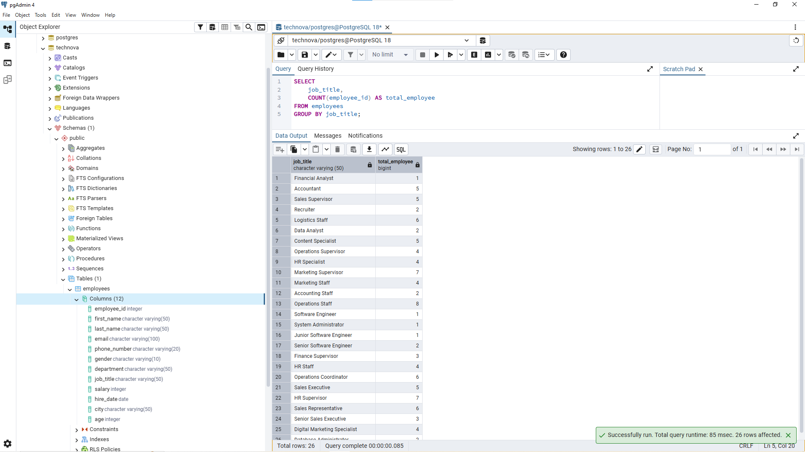
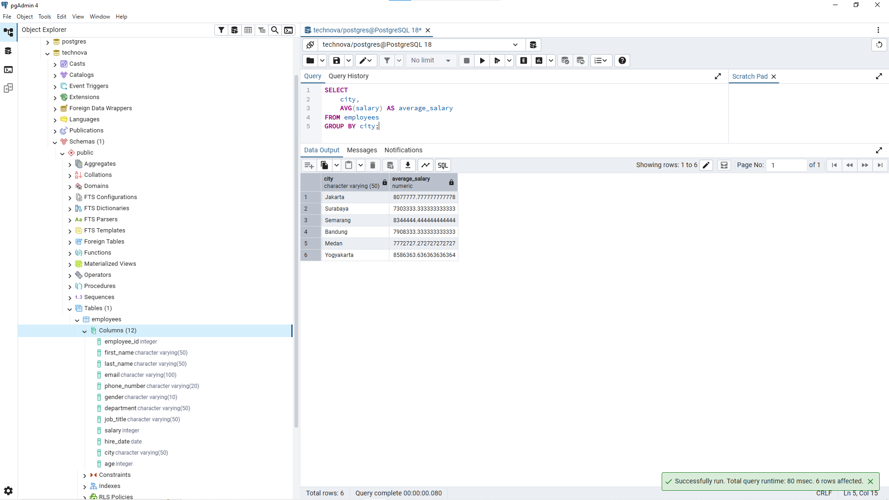
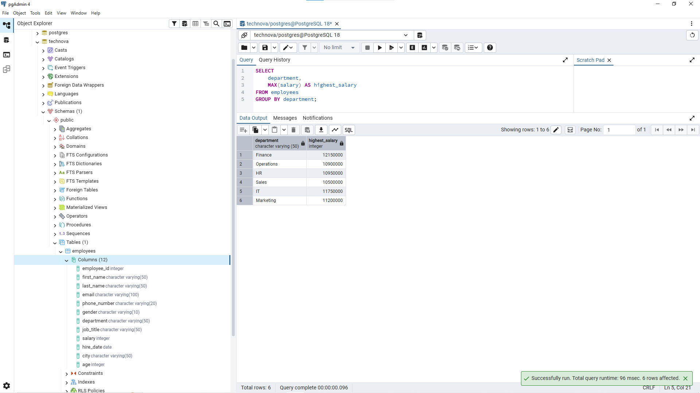
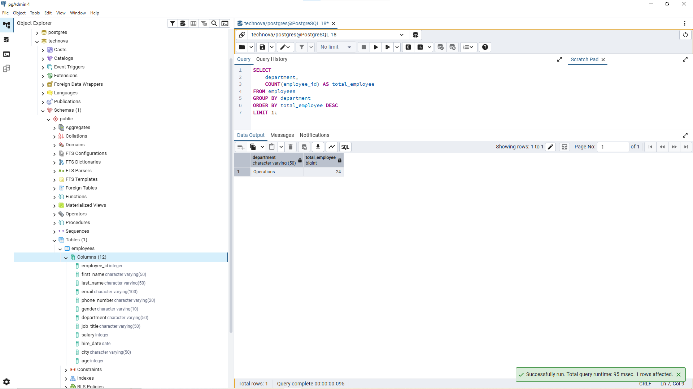
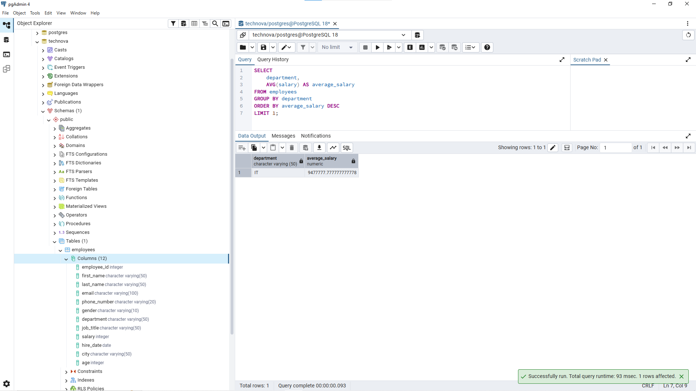

# Lesson 09 - GROUP BY

## Overview

This lesson focuses on using `GROUP BY` to summarize and analyze data based on categories.

The goal of this lesson is to understand how analysts combine grouping with aggregate functions such as `COUNT()`, `AVG()`, `SUM()`, `MAX()`, and `MIN()` to answer business questions.

A Data Analyst often uses `GROUP BY` when creating reports about employee count, salary analysis, business performance, and other summary information.


---

## Business Scenario

Imagine you're a Junior Data Analyst at **TechNova Solutions**.

HR and management need employee reports that provide summarized information instead of individual employee records.

For example:

- Finding the number of employees in each department.
- Analyzing average salary across different cities.
- Finding the highest salary in each department.
- Comparing employee distribution between categories.

Your task is to use `GROUP BY` and aggregate functions to answer these business questions.

---

# GROUP BY

`GROUP BY` is used to organize rows with the same value into groups.

It is commonly used together with aggregate functions to calculate summary information from each group.

Example:

```sql
SELECT
    department,
    COUNT(*) AS total_employee
FROM employees
GROUP BY department;
```

The query above groups employees based on department and counts how many employees exist in each department.

Result example:

| department | total_employee |
|---|---:|
| Finance | 11 |
| Operations | 24 |
| HR | 17 |
| Sales | 19 |
| IT | 9 |
| Marketing | 20 |

---

# Aggregate Functions

`GROUP BY` is usually combined with aggregate functions.

Common aggregate functions:

| Function | Purpose |
|---|---|
| COUNT() | Count the number of rows |
| AVG() | Calculate average value |
| SUM() | Calculate total value |
| MAX() | Find the highest value |
| MIN() | Find the lowest value |

---

# Business Questions


## 1. Count Employee Based on Job Title

**Business Question:**

"HR wants to know how many employees exist for each job title."


**Query:**

```sql
SELECT
    job_title,
    COUNT(employee_id) AS total_employee
FROM employees
GROUP BY job_title;
```


**Result:**




**Purpose:**

This query helps HR understand employee distribution based on job position.

`GROUP BY` is used because the requirement is not looking for individual employees, but a summary of each job title.

---

## 2. Find Average Salary Based on City

**Business Question:**

"Finance wants to analyze the average salary for each city."


**Query:**

```sql
SELECT
    city,
    AVG(salary) AS average_salary
FROM employees
GROUP BY city;
```


**Result:**




**Purpose:**

This query helps analyze salary differences between locations.

In real analysis, average salary by location can support:

- Compensation analysis.
- Salary adjustment decisions.
- Workforce planning.

---

## 3. Find Highest Salary in Each Department

**Business Question:**

"Management wants to know the highest salary available in each department."


**Query:**

```sql
SELECT
    department,
    MAX(salary) AS highest_salary
FROM employees
GROUP BY department;
```


**Result:**




**Purpose:**

This query helps management understand the highest compensation level in each department.

`MAX()` is used because the requirement focuses on the highest salary value inside each group.

---

## 4. Find Department With The Most Employees

**Business Question:**

"HR wants to know which department has the highest number of employees."


**Query:**

```sql
SELECT
    department,
    COUNT(employee_id) AS total_employee
FROM employees
GROUP BY department
ORDER BY total_employee DESC
LIMIT 1;
```


**Result:**




**Purpose:**

This query combines:

- `GROUP BY` to create department groups.
- `COUNT()` to calculate employee numbers.
- `ORDER BY` to sort the highest value.
- `LIMIT` to return the top result.

This approach is commonly used when analysts need to find top-performing categories.

---

## 5. Find Department With Highest Average Salary

**Business Question:**

"CEO wants to know which department has the highest average salary."


**Query:**

```sql
SELECT
    department,
    AVG(salary) AS average_salary
FROM employees
GROUP BY department
ORDER BY average_salary DESC
LIMIT 1;
```


**Result:**




**Purpose:**

This query helps management compare salary levels between departments.

The analysis process:

- Group employees by department.
- Calculate average salary.
- Sort from highest to lowest.
- Return the highest result.

---

# Analyst Thinking

Before using `GROUP BY`, a Data Analyst should consider:

- What category should be used for grouping?
- What metric needs to be calculated?
- Which aggregate function matches the business question?
- Does the result need sorting?
- Does the business require one result or multiple results?


Example:

Business request:

"Which department has the highest average salary?"


A Data Analyst should identify:

- Category: department
- Metric: salary
- Calculation: AVG()
- Ranking: highest to lowest
- Result: top department


The hardest part of analysis is usually translating business questions into data logic before writing SQL.

---

# DISTINCT vs GROUP BY

`DISTINCT` and `GROUP BY` can look similar, but they solve different problems.


`DISTINCT` is used when analysts only need unique values.

Example:

"Show all departments available in the company."


`GROUP BY` is used when analysts need calculations or comparisons between groups.

Example:

"Show the number of employees in each department."


The decision depends on the business requirement.

---

# Key Learning

In this lesson, I learned:

- How to use `GROUP BY` to summarize data.
- How to combine `GROUP BY` with aggregate functions.
- The difference between `DISTINCT` and `GROUP BY`.
- How to calculate count, average, and maximum values by category.
- How to translate business questions into SQL aggregation logic.

---

# Files

```
09_group_by/
├── README.md
├── queries.sql
└── images/
    ├── group_by_job_title.png
    ├── group_by_city_salary.png
    ├── group_by_highest_salary.png
    ├── group_by_most_employee.png
    └── group_by_highest_average_salary.png
```

---

# Next Step

The next lesson will focus on using `HAVING` to filter grouped data based on aggregate results.