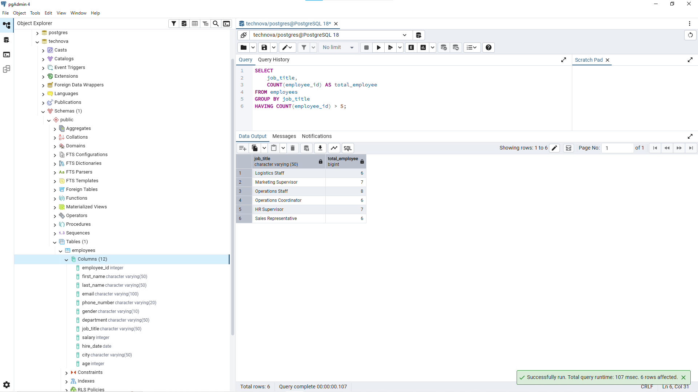
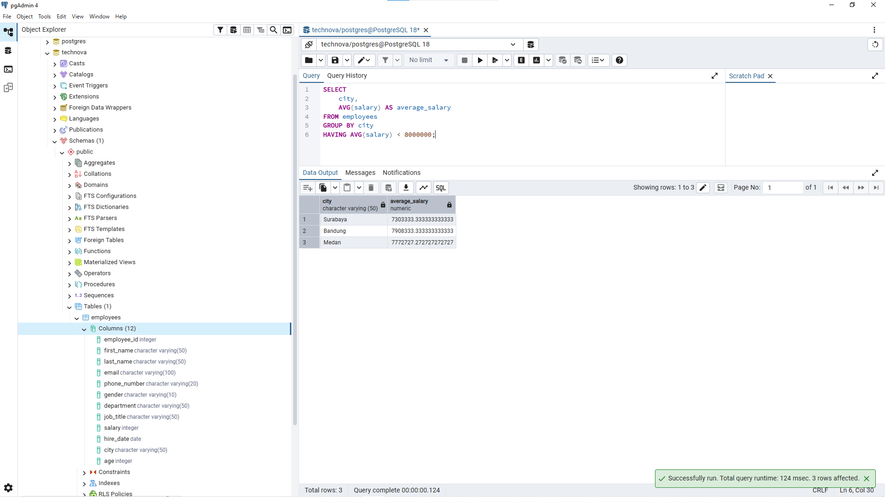
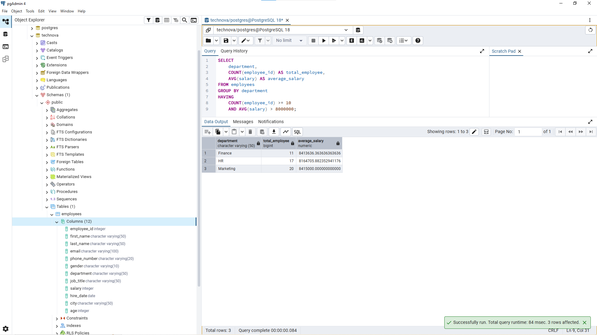

# Lesson 10 - HAVING

## Overview

This lesson focuses on using `HAVING` to filter grouped data after aggregation.

The goal of this lesson is to understand how analysts filter summary results created by `GROUP BY` and aggregate functions such as `COUNT()` and `AVG()`.

A Data Analyst often uses `HAVING` when analyzing reports that require conditions based on calculated values, such as employee count, average salary, or other business metrics.

---

## Business Scenario

Imagine you're a Junior Data Analyst at **TechNova Solutions**.

HR and management need employee reports that focus on summarized information instead of individual employee records.

For example:

- Finding job positions with a certain number of employees.
- Identifying cities with specific salary conditions.
- Finding departments that match multiple business requirements.

Your task is to use `GROUP BY` and `HAVING` to answer business questions based on aggregated data.

---

# HAVING

`HAVING` is used to filter the result of aggregate calculations after `GROUP BY`.

`HAVING` is different from `WHERE`.

`WHERE` filters individual rows before aggregation, while `HAVING` filters grouped results after aggregation.

Example:

```sql
SELECT
    department,
    AVG(salary) AS average_salary
FROM employees
GROUP BY department
HAVING AVG(salary) > 8000000;
```

The query above first groups employees by department, calculates the average salary, and then filters departments based on the calculated average.

---

# WHERE vs HAVING

`WHERE` and `HAVING` are used at different stages of analysis.

| Clause | Purpose |
|---|---|
| WHERE | Filter individual records before aggregation |
| HAVING | Filter grouped results after aggregation |

Example:

Finding employees with salary above 8 million:

```sql
SELECT *
FROM employees
WHERE salary > 8000000;
```

Finding departments with average salary above 8 million:

```sql
SELECT
    department,
    AVG(salary) AS average_salary
FROM employees
GROUP BY department
HAVING AVG(salary) > 8000000;
```

The correct clause depends on the level of analysis.

---

# Business Questions

## 1. Find Job Title With More Than 5 Employees

**Business Question:**

"HR wants to know which job titles have more than 5 employees."

**Query:**

```sql
SELECT
    job_title,
    COUNT(employee_id) AS total_employee
FROM employees
GROUP BY job_title
HAVING COUNT(employee_id) > 5;
```

**Result:**



**Purpose:**

This query helps HR understand employee distribution across different job positions.

`GROUP BY` is used because the analysis is based on job title level.

`HAVING` is required because the condition uses `COUNT()`, which is created after aggregation.

---

## 2. Find Cities With Average Salary Below 8 Million

**Business Question:**

"Finance wants to analyze which cities have an average salary below 8 million."

**Query:**

```sql
SELECT
    city,
    AVG(salary) AS average_salary
FROM employees
GROUP BY city
HAVING AVG(salary) < 8000000;
```

**Result:**



**Purpose:**

This query helps Finance analyze salary differences between locations.

This analysis can support:

- Compensation analysis.
- Salary adjustment decisions.
- Workforce planning.

`HAVING` is used because the filter depends on the result of `AVG(salary)`.

---

## 3. Find Departments With Minimum 10 Employees and Average Salary Above 8 Million

**Business Question:**

"CEO wants to know which departments have at least 10 employees and an average salary above 8 million."

**Query:**

```sql
SELECT
    department,
    COUNT(employee_id) AS total_employee,
    AVG(salary) AS average_salary
FROM employees
GROUP BY department
HAVING 
    COUNT(employee_id) >= 10
    AND AVG(salary) > 8000000;
```

**Result:**



**Purpose:**

This query combines multiple conditions inside `HAVING`.

The analysis identifies departments that are:

- Large based on employee count.
- Higher based on average salary.

This type of analysis is useful when management needs to evaluate groups based on multiple business criteria.

---

# Analyst Thinking

Before using `HAVING`, a Data Analyst should consider:

- Is the analysis based on individual records or grouped data?
- What category should be used for grouping?
- What metric needs to be calculated?
- Does the condition use an aggregate function?
- Should the filtering happen before or after aggregation?

Example:

Business request:

"Which department has at least 10 employees and a high average salary?"

A Data Analyst should identify:

- Category: department
- Metrics: employee count and salary
- Calculation: COUNT() and AVG()
- Filter stage: after aggregation
- SQL clause: HAVING

The hardest part of SQL analysis is translating business questions into the correct data logic before writing the query.

---

# WHERE vs HAVING Decision

A simple way to decide:

Use `WHERE` when filtering existing column values.

Example:

```sql
salary > 8000000
```

Use `HAVING` when filtering calculated values.

Example:

```sql
AVG(salary) > 8000000
```

The decision depends on whether the condition exists before or after aggregation.

---

# Key Learning

In this lesson, I learned:

- How to use `HAVING` to filter grouped data.
- The difference between `WHERE` and `HAVING`.
- How to combine `HAVING` with aggregate functions.
- How to apply multiple conditions inside `HAVING`.
- How to translate business requirements into aggregation logic.

---

# Files

```
10_having/
├── README.md
├── queries.sql
└── images/
    ├── having_job_title_count.png
    ├── having_city_salary.png
    └── having_department_condition.png
```

---

# Next Step

The next lesson will focus on using basic SQL functions to transform and analyze data.