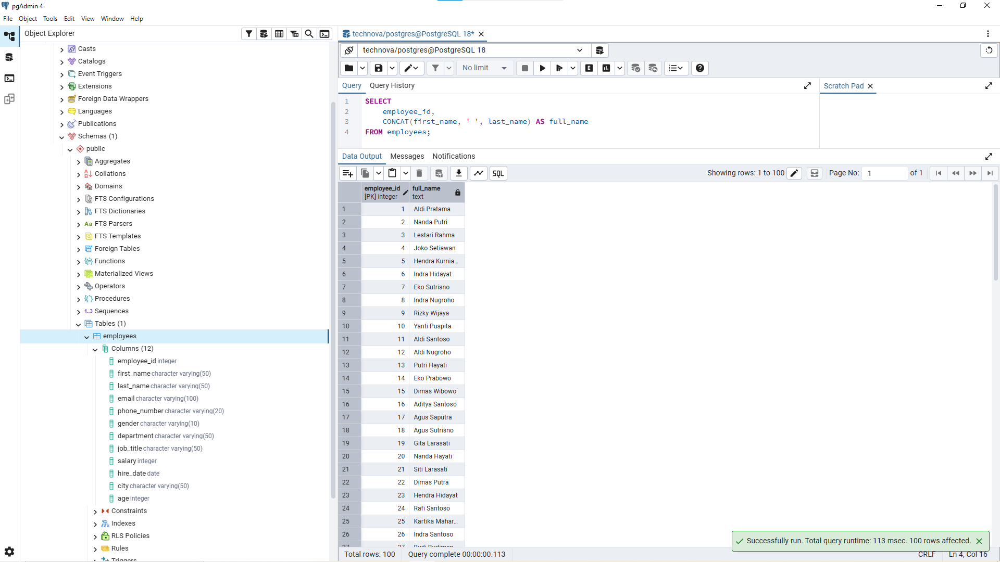
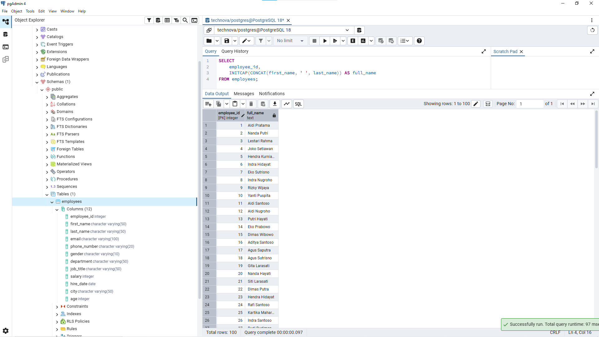
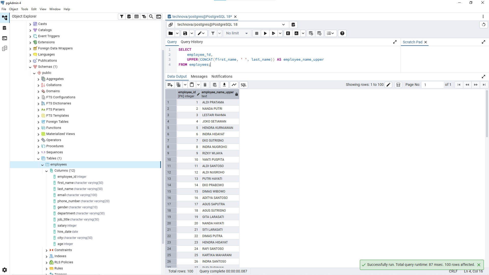
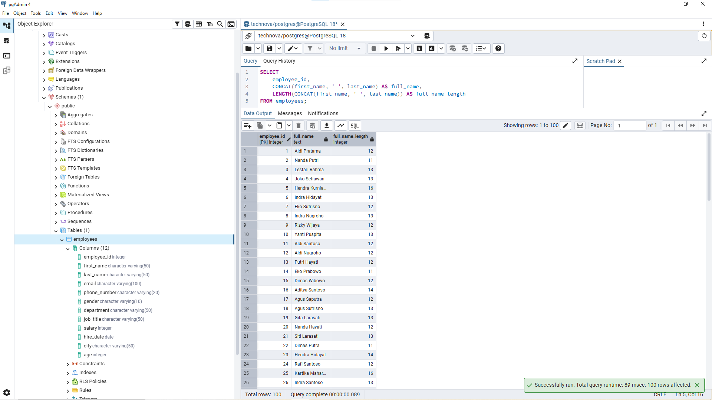
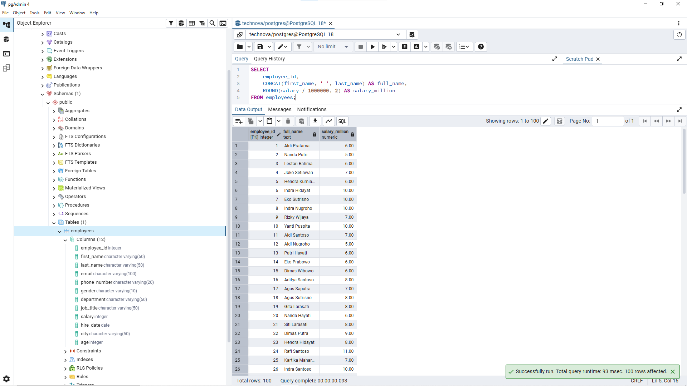
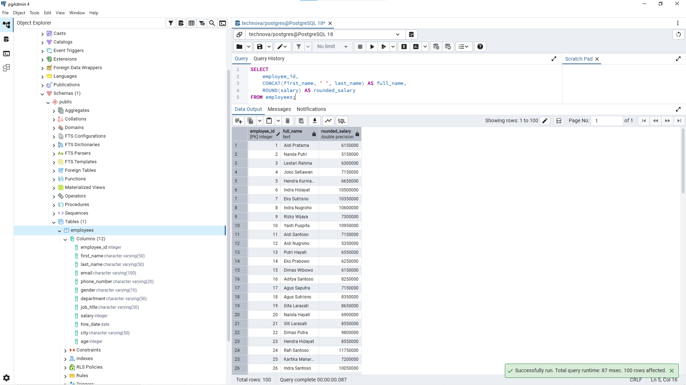
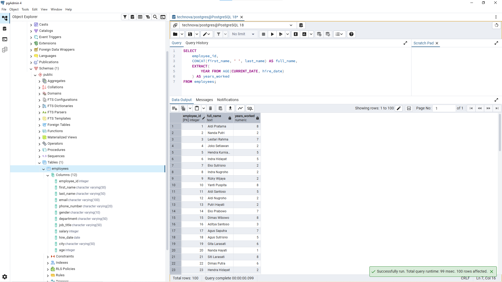
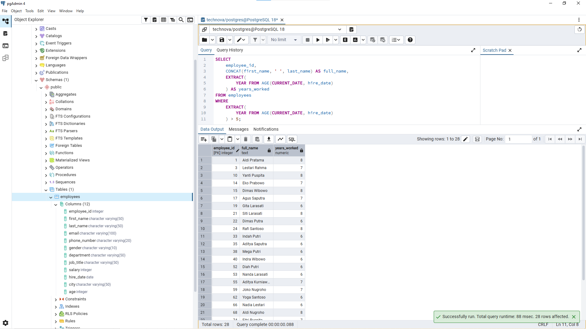
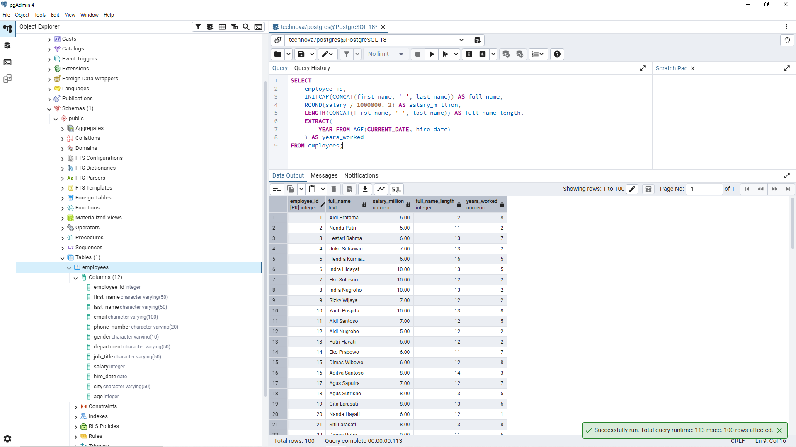

# Lesson 11 - Basic Functions

## Overview

This lesson focuses on using `SQL Functions` to transform and format existing data.

The goal of this lesson is to understand how analysts use functions to create new representations of data without changing the original database values.

A Data Analyst often uses functions when preparing reports that require formatted text, calculated values, or date-based analysis.

---

## Business Scenario

Imagine you're a Junior Data Analyst at **TechNova Solutions**.

HR and Finance need employee reports with different data formats.

Examples:
- Combining first name and last name into a single employee name.
- Standardizing employee name formats for reports.
- Displaying salary in a simpler format.
- Calculating employee working duration based on hire date.

The goal is to transform data through SQL queries without changing the original database.

---

# SQL Functions

`SQL Functions` are used to process existing data and return a new value based on a specific operation.

Functions do not change the original data stored in the database.

Example:

Data stored:

```
first_name = John  
last_name = Smith  
salary = 8500000
```

After transformation:

```
full_name = John Smith  
salary_million = 8.50
```

The database remains unchanged.

---

# String Functions

String functions are used to process text data.

| Function | Purpose |
|---|---|
| CONCAT() | Combine multiple text values |
| UPPER() | Convert text to uppercase |
| INITCAP() | Convert text to proper case |
| LENGTH() | Count number of characters |

---

# Business Questions

## 1. Create Employee Full Name

**Business Question:**

"HR wants to see employee full names in one column."

**Query:**

```sql
SELECT
	employee_id,
	CONCAT(first_name, ' ', last_name) AS full_name
FROM employees;
```

**Result:**



**Purpose:**

This query combines first_name and last_name into one column for reporting purposes.

---

## 2. Standardize Employee Name Format

**Business Question:**

"HR wants employee names displayed in proper case."

**Query:**

```sql
SELECT
	employee_id,
	INITCAP(CONCAT(first_name, ' ', last_name)) AS full_name
FROM employees;
```

**Result:**



**Purpose:**

This query formats employee names without changing original data.

---

## 3. Create Uppercase Employee Name

**Business Question:**

"HR wants employee names displayed in uppercase format."

**Query:**

```sql
SELECT
	employee_id,
	UPPER(CONCAT(first_name, ' ', last_name)) AS employee_name_upper
FROM employees;
```

**Result:**



**Purpose:**

This query transforms text format based on report requirements.

---

## 4. Analyze Employee Name Length

**Business Question:**

"HR wants to know the number of characters in employee full names."

**Query:**

```sql
SELECT
	employee_id,
	CONCAT(first_name, ' ', last_name) AS full_name,
	LENGTH(CONCAT(first_name, ' ', last_name)) AS full_name_length
FROM employees;
```

**Result:**



**Purpose:**

`LENGTH()` calculates total characters in the full name.

The space between first name and last name is counted because it is part of the complete string.

---

# Numeric Functions

Numeric functions are used to process numerical values.

---

## 5. Display Salary in Million Rupiah

**Business Question:**

"Finance wants salary displayed in million rupiah."

**Query:**

```sql
SELECT
	employee_id,
	CONCAT(first_name, ' ', last_name) AS full_name,
	ROUND(salary / 1000000, 2) AS salary_million
FROM employees;
```

**Result:**



**Purpose:**

This query makes salary values easier to read in financial reports.

---

## 6. Display Rounded Salary

**Business Question:**

"Finance wants rounded salary values for summary reports."

**Query:**

```sql
SELECT
	employee_id,
	CONCAT(first_name, ' ', last_name) AS full_name,
	ROUND(salary) AS rounded_salary
FROM employees;
```

**Result:**



**Purpose:**

This query rounds salary values for simpler presentation.

---

# Date Functions

Date functions are used to analyze information related to time.

---

## 7. Calculate Employee Working Duration

**Business Question:**

"HR wants to know how long each employee has worked at TechNova."

**Query:**

```sql
SELECT
	employee_id,
	CONCAT(first_name, ' ', last_name) AS full_name,
	EXTRACT(
		YEAR FROM AGE(CURRENT_DATE, hire_date)
	) AS years_worked
FROM employees;
```

**Result:**



**Purpose:**

This calculates employee working duration dynamically from hire_date.

A new column does not need to be created because the value changes over time.

---

## 8. Find Senior Employees

**Business Question:**

"HR wants employees who have worked for more than 5 years."

**Query:**

```sql
SELECT
	employee_id,
	CONCAT(first_name, ' ', last_name) AS full_name,
	EXTRACT(
		YEAR FROM AGE(CURRENT_DATE, hire_date)
	) AS years_worked
FROM employees
WHERE
	EXTRACT(
		YEAR FROM AGE(CURRENT_DATE, hire_date)
	) > 5;
```

**Result:**



**Purpose:**

This query combines date calculation and filtering logic.

---

## 9. Create Employee Profile Summary

**Business Question:**

"HR wants a complete employee summary report containing employee information, salary, name length, and working duration."

**Query:**

```sql
SELECT
	employee_id,
	INITCAP(CONCAT(first_name, ' ', last_name)) AS full_name,
	ROUND(salary / 1000000, 2) AS salary_million,
	LENGTH(CONCAT(first_name, ' ', last_name)) AS full_name_length,
	EXTRACT(
		YEAR FROM AGE(CURRENT_DATE, hire_date)
	) AS years_worked
FROM employees;
```

**Result:**



**Purpose:**

This query combines multiple `SQL Functions` into one business report.

This represents how analysts combine several concepts to prepare reports.

---

# Analyst Thinking

Before using `SQL Functions`, a Data Analyst should understand:

- Does the business need a new stored column or only a report transformation?
- What type of data needs transformation?
- Can the value be calculated dynamically?
- Will changing the original database create unnecessary maintenance?

Example:

Business request:

"Show employee working duration."

Source data:

hire_date

Calculation:

current_date - hire_date

Output:

years_worked

A Data Analyst should focus on solving the business requirement, not immediately changing the database structure.

---

# Key Learning

In this lesson, I learned:

- How to use `SQL Functions` for data transformation.
- How to use string functions for text formatting.
- How to use numeric functions for number formatting.
- How to use date functions for time-based analysis.
- Why transformation is usually done in queries instead of changing original data.
- How to combine multiple functions to create business reports.

---

# Files

```
11_basic_functions/
├── README.md
├── queries.sql
└── images/
    ├── function_concat.png
    ├── function_initcap.png
    ├── function_upper.png
    ├── function_length.png
    ├── function_salary_million.png
    ├── function_round_salary.png
    ├── function_years_worked.png
    ├── function_senior_employee.png
    └── function_profile_summary.png
```

---

# Next Step

The next repository will focus on `intermediate SQL` concepts such as `JOIN`, `multiple tables`, and `business analysis`.